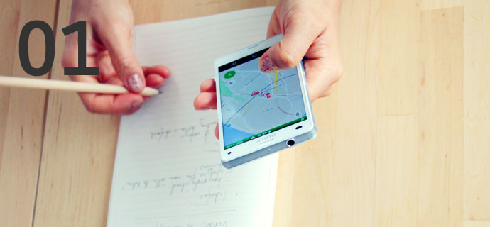
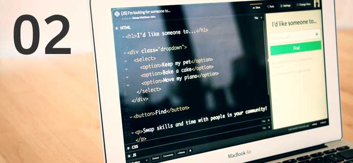
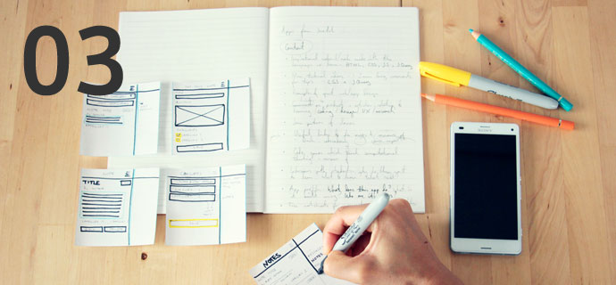
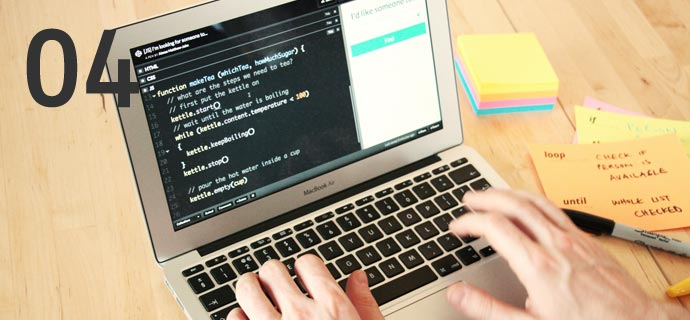
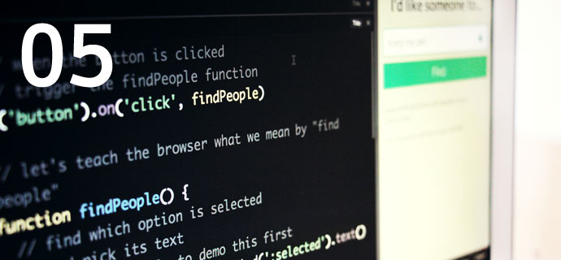
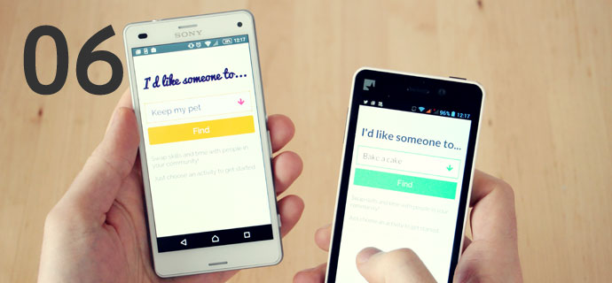
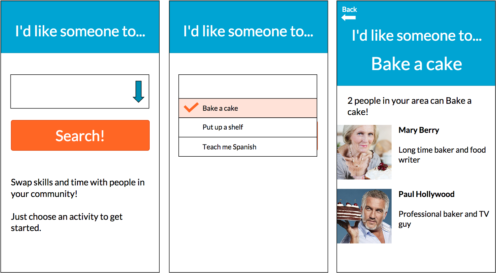
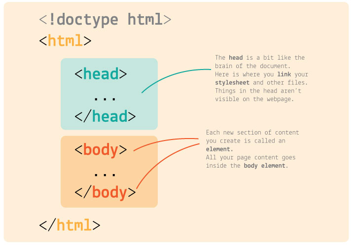
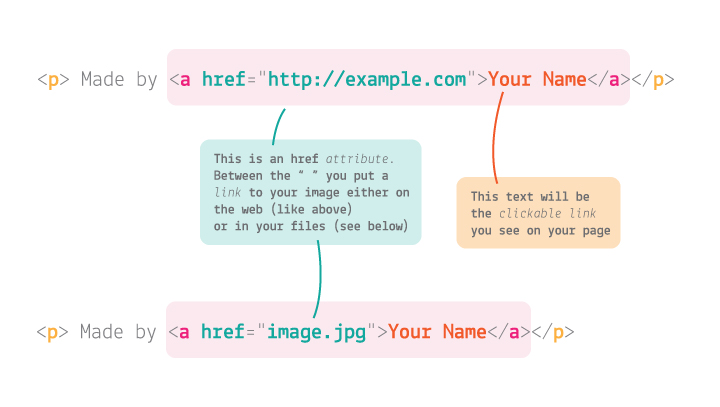
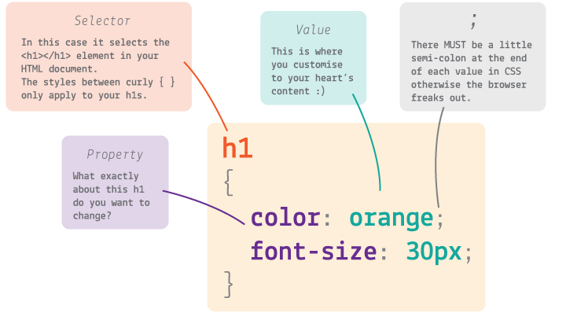

# Coding and app-making for beginners

## Day 1

1. Welcome & introductions 
* [The plan for this course](#what-is-the-plan)
* Group discussion: [what is an app?](#what-is-an-app)
* [Key concepts](#key-concepts): interface, data and logic
* [Your project brief](#your-brief)
* [Workshop](#lets-code): HTML & CSS

<!--

Good morning :)

It is a good morning isn't it?

It is SO good to have you all here today!

The fact that you got out of bed on a Saturday morning, to come here and learn to code, that's commitment, and we really admire that.

We want this course to be a valuable learning experience for you all, and we want you to have as much fun learning as we have teaching!

-->

### When is lunch?

Research shows that people focus much better when they know what time they're going to eat...

So, we will have **lunch break** at around 1pm for 1 hour, aiming to wrap up by 4pm.

### Two words about ourselves

* **Matteo** studied graphic design. He also taught himself to code. He built social platforms and educational games for the BBC, Science Museum and now teaches at Ravensbourne.  

* **Aimee** studied fashion design, makes clothes and websites. She is the *jargon buster*, the bridge between beginners and professional coders.

**No computer scientists**, we all learned code by ourselves through experimenting and tinkering. 

We want to show you that it's easy to get started and anyone can give it a go!

### Introduce each other

We want this course to be **informal** and relaxed, so if you have any questions at any time just ask. We're also going to ask you many **questions**!

We'd like you to introduce yourself to your neighbour. Then we'll ask you to introduce each other to the rest of the group.

1. A bit about yourself
* How did you hear about this course?
* Why are you on this course?

<!--* What is your experience with coding so far?-->

You can jot down the answers on post-its and we'll then stick them on the wall...

<!-- make sure we ask questions to the people that are being introduced! -->

<!--

This course is about getting **creative** with **code**.

Getting familiar with how coders work day to day, and experiencing the **design and development process** first-hand. How to take an idea from zero to working prototype. 

For many of you, this will be a **memorable day**. You'll write your **first line of code**, and in a few weeks you'll have made **your own app**, from scratch!

We're going to show you the **basics** and together we'll create an app **template** that you can then customise. The app template will connect to an online database to load data, and manipulate it in response to user inputs. 

Using **HTML**, **CSS** and **JavaScript**!

This is an introductory course, inevitably there are parts of the process that we won't cover (such as how to market your app or package it for a specific market).

It's going to be **challenging** and we want to make sure that you also have **fun**!
 
We're not here to talk at you, but to work with you and we want you to **work together** and help each other.

-->

### GitHub

All the course material is here: 
[**github.com/CodeAndCake/AppsFromScratch**](https://github.com/CodeAndCake/AppsFromScratch) 

Including notes from each session, exercises, sample code, presentations and links to learn more!


# What is the plan?

When	| What	
---	| ----	
 | On the first day we discuss key concepts around apps (interface, logic, data) and start making with HTML & CSS.
 | What exactly is programming anyway? We introduce the principles of programming, then start playing with JavaScript.
 | Data! Where to find it and how to use it. Your app's data has to be stored somewhere!
 | You will use JavaScript _libraries_ to speed up your development and learn how to troubleshoot your code, aka _debugging_.
 | By this point you have a rough app prototype, which you can then hack to apply your own ideas and content.
 | Tweak your app prototype. Celebrate your achievements, and take away free resources to continue your learning journey.

# What is **code**?

Can you fill in the blanks?

#### [...] code

Think of words/phrases that end with `code`.

<!-- *Morse code*, *post code*, *dress code*... -->

Code existed **before computers**.

Code is about

*   transmitting information
*   giving instructions
*   **communication**

If I want to talk to my **grandma**, I need to use Italian. To communicate with you, I use English. 

To **talk to a computer**, we use...

#### Code is **instructions** to a computer: extremely powerful, fundamentally thick.

### How do you learn to code?

Remember how you learned your first language as a child?

You learned your first language by copying people around you, observing their reactions to your actions.

> If I say `mum` then that one person will respond. She also responds when I cry. She doesn't respond to other names, it seems.

Learning a coding language is like **learning a new language**.

#### **Translating** your ideas into a language your computer understands

#### **Observing** how the computer responds to your inputs and adapting them until it works

#### Like natural languages, there's no *right* or *wrong* way to do it

**Today** you're going to learn **2 new languages**, but before we get into that...


# What is an app?

Let's sketch a **working definition** of *app*.

How do you explain what an app is to someone or something who's never seen/used one, like an *alien*?


### Your turn


Pretending one of us is an *alien*, let's ask some obvious questions and jot down some answers and key words on post-its. 

If people answer with jargon, like *software* or *download*, then we ask them to explain those too to our *alien*.

* What does an app **look like**?  
* How do you **interact** with an app? Do you speak to it, do you shake it etc?
* What are apps **made out of**?
* **Who uses** apps? Why?

<!--
* Can you buy apps? Who sells them?
* Would you download an app if you need it only once or twice?
-->


### What is an app, then?

There is no clear-cut definition of *app*.

For the sake of this course, we like to think of apps as **small digital tools** that are connected to the Web.

To use an analogy, if a website is like a *book*, which you use to find and consume information, an app is closer to a *whisk*, which you use to make something with.


Apps generally have a specific function, or a small set of functions. They are not trying to do everything.


This is *not* a good app. It is not **usable**, even though all the tools it features could be usable (and possibly useful) on their own.

### **How long** does it take to make an **app**?

This course is 24 hours long, ie **3 working days**.

The point of this course is to *introduce* you to the app-making **process** and **tools**.

* **Thimble**: free online code editor, live preview
* **Firebase**: real-time database, excellent for prototyping
* **HTML**, **CSS** and **JavaScript**: universal languages, entry point to more specialised ones (and useful to know for other jobs!)
* **GitHub repository**: industry-standard collaborative version-control system

This is an introductory course, inevitably there are parts of the process that we won't cover (such as how to market your app or package it for a specific market).

<!-- In 3 days we may not get an app on the App Store, but don't lose heart! -->

In 3 days you will **get started with coding** and by the end you will:

* have a solid foundation to continue learning
* have first-hand experience of the design and development process
* feel confident speaking about your ideas with other designers, coders and product managers

<!--### What apps do you use most? 

And do you know what they have in common? Let us tell you...-->


# Breaking down apps

### Key concepts

#### Interface

The parts of the app you directly interact with (touch, read, click, speak to etc.)

A good interface must be *usable* and should align to a user's *mental models* (how does s/he expect the interface to work). 

#### Data

The *fuel* of an app, the raw ingredients that the interface presents to you (more or less *cooked*). 

Data is also the information that you provide an app with: the username you type in, the pictures you upload, the geo-location apps stream...

#### Logic

The **coded rules** that determine how the app interface reacts to your *inputs*, how it manipulates data and how it presents it to you (*output*).

At its core, the logic building block of an app is a statement that sounds like `if this, then that`, eg: `if you click on this button, the app will show you this section`.

Many `if this then that` blocks can build quite complex behaviours.


# Your brief

### Make an app that helps people sort through heaps of data to **find who/what they are looking for**.

**The *who/what* is up to you**. People may be looking for other people in their community to do something together, or they may be looking for food recipes, places to go, books to read, films to watch.. 

No matter which data the app uses, its **logic** will be the same:

1. **Load data** from an online database 
* Capture **user inputs**, when they click on buttons, type into text boxes or choose from a dropdown menu etc.
* **Sort data** according to user choices, for instance filtering out data that doesn't match their choices
* Present a human-readable **output** 

### Interface

Here's an initial sketch of how the app may look and work.

[](https://app.moqups.com/aimeebethmj@gmail.com/424uOp4p55/view/page/a80b23701)

### Data

We'll show you how to create structured data, aka a **database**. 

No scary formula or data crunching though! 

Later on you can change the data to make your app serve your own purposes.

### Logic

We'll teach you how to use JavaScript to assign *behaviour* to your interface, coding logic like `if you click this button, then do XYZ`.

We'll also show you that you don't need to write all this code from scratch. There are plenty of ready-made code *libraries* that you can use in your own project. No need to reinvent the wheel!


# Let's code

> Good coders don't type. They **copy-paste**.

Before we start coding, make sure you're familiar with the most important keyboard shortcuts for a good coder.

### Copy

Mac <kbd>cmd</kbd> + <kbd>c</kbd>

PC <kbd>ctrl</kbd> + <kbd>c</kbd>

### Cut & copy

Mac <kbd>cmd</kbd> + <kbd>x</kbd>

PC <kbd>ctrl</kbd> + <kbd>x</kbd>

Very useful when you want to *move* one block of code from one place to another.

### Paste

Mac <kbd>cmd</kbd> + <kbd>v</kbd>

PC <kbd>ctrl</kbd> + <kbd>v</kbd>


## HTML & CSS crash course

We're going to learn how to:

* Write HTML to **structure** your app interface 
	* Create several types of **text** (paragraphs, headings)
	* Create **inputs** (dropdowns, buttons, text boxes)
	* Create **links** to other Web pages
	* Add **images**
	 
* Write CSS to **style** your app interface
	* Design your app **typography**
	* Set your app **colours**
	* **Search** for code online and integrate what you find in your project (that's what coders do most of the time!)

## Step by step

Go to [thimble.mozilla.org](https://thimble.mozilla.org/) and sign up (it's free). 

Then log in and click on `Start a project from scratch`.

### Content first

> Content first, style later!

It's good practice to build the **HTML** first, and then make it _stylish_ with CSS.

#### HTML basics

HTML is a *markup* language, which you use to *format your content*. 

Essentially, you wrap content inside bits of code called tags.

`<tag> content </tag>`

The bits of code inside angle brackets `<` and `>` are instructions for the computer:

* They describe the content they wrap 
* Define where it starts `<tag>`
* Define where it ends `</tag>`

For example, this is how you wrap a paragraph of text in `p` tags:

`<p> This is a paragraph. </p>`

`p` stands for *paragraph*, of course.

#### HTML skeleton

Thimble created an HTML skeleton for you, containing the basic **building blocks**: `html`, `head` and `body` tags.

Every HTML document, at the bare bones, needs to have this structure.


```html
<!doctype html>
<html>
	<head>
		...
	</head>
	<body>
		...
	</body>
</html>	
```




#### Head

In the `head` you can change the `title`.  
	
Later, you'll add links to external resources like *stylesheets* and *meta* information.

What you put in the `head` is not visible to the user.

#### Body

In the `body` you will put all the **interface elements** that are visible to the user.


# Let's start building

#### Sections

Inside the `body`, add in two `<section>` elements

```html
	<body>
		<section></section>
		<section></section>
	</body>
```


#### Fancy logo


It's important. We recommend https://www.hipsterlogogenerator.com/ for quick and easy hipster logos :)

Take a couple of minutes to quickly make your own fancy logo.

To place your logo in your HTML document create an `img` element inside the first `section`. `img` element doesn't need a closing tag (it's one of the exceptions to the general rule of closing tags).

```html
<section>
	
</section>
```

Every `img` requires a link - either a weblink to the image or the location of the image you're using in your files. In Thimble, you can upload your logo and put the name inside `src=" "`

```html
<section>
	
</section>
```
If you're taking an image from the web you need to use the link to the image alone. Right click on the image and Copy Link Address. Then paste it inside `src=" "` 

```html
<section>
	
</section>
```


#### Headings


Inside the first `section`, add a **heading** (`h1`) and a **sub-heading** (`h2`). These will be the most important pieces of information of your app's main page.

```html
<section>
	<h1>Your app name</h2>
	<h2>What it does</h2>
</section>
```

#### Paragraphs

Explain how your app works, and what you want people to do first.  

```html
<section>
	...
	<p>Swap skills and time with people in your community!</p>
  	<p>Just choose an activity to get started.</p>
</section>
```

`p` is for *paragraph*

#### Dropdown

This is the first interactive element of your app.

It's a set of `options` that people can choose from.

Under your headings, add in a `<select>` element. Inside that, add in some `<option>` elements.

```html
<section>
	...
	<select>
    <option>Keep my pet</option>
    <option>Bake a cake</option>
    <option>Move my piano</option>
  </select>
</section>
```

#### Button

Next you'll need a *find* or *search* button. What do you think is the HTML code to make a button?

It's `<button>` :)

```html
<section>
	...
	<button>Find</button>
</section>
```

#### Hyperlinks



You can add **hyperlinks** to our content using the `a` element.
	
```html
<a href="http://example.com"> the clickable text </a>
```

`a` is for *anchor* :anchor:

Add in a little credit at the bottom of your page, just above the closing `</body>` tag.

```html
<p>Made with love by <a href="http://example.com"> Your Name</a></p>
```

### Publish your project


Now click `Publish` to see how your app looks so far. :+1:


### Style later

Now the fun part: **CSS**!

There's a `link` in the `head` of your app which points to a CSS file called **style.css**. This is where you add your own styles.


```html
<link rel="stylesheet" href="css/style.css">
```

You can have more than just one CSS file, and we'll show you how it's good practice to work on several small files rather than one long document you may get lost into.


#### CSS basics

You use CSS to style HTML.

CSS looks and works differently than HTML. 

```css
selector
{
	property: value;
	property: value;
}
```

The part before the curly brackets `{` and `}` is the **selector**. This ***selects* the element** from your HTML document.

In CSS you can select multiple HTML elements in one go.

For example, to select all paragraphs you can write

```css
p
{
	/* your styles for paragraph here */
}
```

CSS **properties** define how HTML elements are displayed.





The first bit is the property name, eg `color`, and the second bit is the value, eg `green`. They are separated by a `:` colon, and you MUST end each line of CSS with a `;` semicolon (for real, otherwise your browser will choke).

For example ...

```css
p
{
	color: green;
}
```

... will turn *every* paragraph in your HTML green.

#### Play around a bit

Let's spend the next 5-10 minutes getting familiar with CSS. It doesn't matter if your app looks a bit funny for now. Things you can do:

* change the `color` of your `h1` or `h2` elements
* align some elements to the `center` (*google* how to do it)
* hide some elements
* change the `background-color` of the whole page 

What else would you like to do? Try and *google* it first, then we can do it together (if it's not too whacky).

#### Search for solutions! 

Part of learning to code and being a coder is searching for answers, every day. You don't need to remember everything and you don't need to learn everything immediately. 

**All the answers can be found on the Web! As coders, we must get used to searching online for solutions.**

#### Inspect websites you like

Did you know, you can see the code which has created every site on the Web? You can use the **Web Inspector** to do this. It's like x-ray specs for websites.

Go to a website (any website) and right-click anywhere on that page, then select `Inspect` (or `Inspect Element` in some browsers).

On the **left panel** of the `Elements` tab you can see all the HTML code for the page you're inspecting. By clicking on an HTML element you'll reveal all the CSS applied to it, on the **right panel**.

You can also play with this code and change the way your favourite websites look (but don't worry, your changes won't affect how other people are experiencing that site). :scream:

Go to a site you like, right-click > `Inspect` and then see if you can find which colours it uses.

#### Fonts

Text is the major carrier of information on an app, so it's good practice to start with **typography**, or *type setting*. That means defining how texts are going to look, which fonts your app is going to use, and the proportions between them in your app layout. 

You can grab a free **font** from [Google Fonts](https://www.google.com/fonts): 

1. Pick a typeface you like
* Click on `Quick-use` (the button with an arrow pointing to the right).
* Choose the font styles you want to use
* Copy the `link` code for it and paste it in your app `head` in Thimble. 

	Where? Before `style.css`

	```html
	<head>
		...
		<link href='https://fonts.googleapis.com/css?family=Lato:400,300,700,900' rel='stylesheet' type='text/css'>
		<link rel="stylesheet" href="css/style.css">
	</head>	
	```
* In `style.css`, define the font for the `body` element (all other elements will inherit it). 

	```css
	body
	{
		font-family: 'Lato', sans-serif;
	}
	```
	
Then you can set more specific rules for headings, paragraphs and bold elements. For instance, you could use a different font just for headings, as well as changing many other aspects of your typography:
	
* `font-family` 
* `font-size`
* `font-weight`
* `font-style`
* `line-height`
* `letter-spacing`
* `word-spacing`
* `text-align`
* `text-decoration`
* `text-transform`
* `text-indent`	
	
#### Background images

You can add images to your app via CSS. This is useful if you want to set different images for different screen sizes (eg: one for mobile, a different one for tablets) as well as fine-tuning how your images should display.

```css
body
{
	background-image: url(http://example.com/image.jpg);
}
```

You can upload your own image files to Thimble (if they're smaller than 3MB), or use images from the Web (provided they're licensed for re-use).

By default background-images *tile*, but we want them to take up the whole available screen space, without losing their aspect ratio (no squashing). 

We can achieve that with `background-size`. This property can take various values: pixel sizes, percentages, and then a couple of interesting keywords. 

* `contain` will scale the image so as to be as large as possible providing that it is **contained** within the background positioning area. 
* `cover` instead, will scale the image, this time to be as large as possible so that the background positioning area is completely **covered** by the background image.

Add `background-size: cover;` to the `body` rule.
```css
body
{
	background-image: url(http://example.com/image.jpg);
 	background-size: cover;
}
```	

<!--

* Introduce **Web Inspector**, HTML and CSS tabs.


* CSS **comments**

* Style `select` and `button`
	* `border: none;`
	* `border-radius`
	* `margin`
	* `padding`
* Colours
	* Web inspector colour picker (maybe pick a colour from Facebook). Everything is lost on *page refresh* so need to copy-paste into our code.
	* `background`
	* `color`
	* `border-color`
	* Check out [Kuler](https://color.adobe.com) and/or [Flat UI colors](https://flatuicolors.com/) for inspirations
 -->
<!--
### Final touches

* Media queries

	```css
	/* if the screen is larger than 600px..  */
	@media (min-width: 600px) {
	  body {
	    max-width: 600px;
	    margin: auto;
	    font-size: 1em;
	  }
	}
	```
* Icons using [FontAwesome](https://fortawesome.github.io/Font-Awesome/)

	```css
	.dropdown
	{
	  position: relative;
	}
	.dropdown:after
	{
	  content: "\f063";
	  font-family: FontAwesome;
	  position: absolute;
	  top: .75em;
	  right: .75em;
	  font-size: 2em;
	  pointer-events: none;
	}
	```

* Make the app look proper on a phone. Google `how to stop phone zooming out pages`

* Make the app **full screen**. Google `how to hide address bar in mobile browser` and you should find [this tutorial](http://www.html5rocks.com/en/mobile/fullscreen/) 

* Add the app to your phone's **home screen**
 
	`<link rel="apple-touch-icon" href="blabla.png">`
	
* Transparency?	
	
* Take inspiration from these fancy demos by Codrops:
	* [Custom select elements](http://tympanus.net/codrops/2014/07/10/inspiration-for-custom-select-elements/)
	* [Minimal form interface](http://tympanus.net/codrops/2014/04/01/minimal-form-interface)
	* [Natural language form](http://tympanus.net/codrops/2013/05/21/natural-language-form-with-custom-input-elements)
-->

### License

[](http://creativecommons.org/licenses/by-nc-sa/4.0)

This work is licensed under a [Creative Commons Attribution-NonCommercial-ShareAlike 4.0 International License ](http://creativecommons.org/licenses/by-nc-sa/4.0)