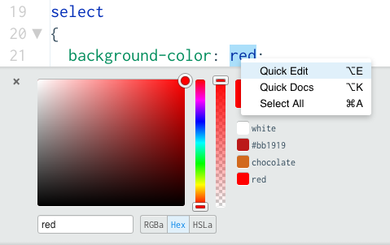
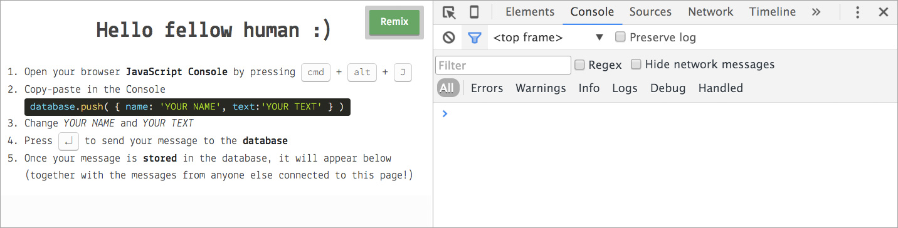

<!--

- [ ] FontAwesome? https://fortawesome.github.io/Font-Awesome/get-started/
- [ ] Homework: now that you have an initial understanding of how the app looks (HTML&CSS) and works (JS+database) start thinking about how you could make it your own. Is it going to be an app to find music, tools, books? What would you like it to be?

-->

<!--

var me = {} // an empty object
var me = new Person() // or a class?

// let's stuff the object with data
me.name = 'Matteo' // String
me.likesPets = true // Boolean, true or false
me.bodyStrength = 3 // Number, between 0 and 5
me.bakingSkills = 4 // Number, between 0 and 5
me.diySkills = 2 // Number, between 0 and 5
me.image = 'http://api.randomuser.me/portraits/men/33.jpg' // String, a URL eg: https://example.com/selfie.jpg
me.about = 'A short blurb about yourself' // String

database.push(me)
-->

<!--
From v2, day 2:

### Areas for improvement

* Try something easier which is more rewarding (possibly something more visual or sound, playful)

### Action points

* Find fun activities for end of day
* How to market your app and idea? (Find where we can direct them to resources)
* Resources / links: jQuery courses etc.
* JS library: how do you know if thats good library?

-->


# Coding and app-making for beginners 

## Day 2

[Last week](../01) we started building your app's **interface** with HTML and CSS. 

Today we'll look at its **data** (using an online *database*) and the **JavaScript logic** that will glue together interface and data.

1. [Workshop](#workshop): HTML & CSS recap.
* [Group task](#ux-research): UX research.
* [What is **programming**](#programming-vs-coding)?
* Meet **JavaScript**: connect your app to an online database. 


# Workshop

### HTML & CSS recap

Different **languages**, separate [**concerns**](http://en.wikipedia.org/wiki/Separation_of_concerns#HTML.2C_CSS.2C_JavaScript).

Think of a group of people working together, eg to make a car, a newspaper, a website, to provide education. What are the different *roles* and *concerns* of these people?

##### 1. **HTML** → content and structure  

##### 2. **CSS** → style and design 

##### 3. **JS** → data and logic

## Step by step

Go to [thimble.mozilla.org](https://thimble.mozilla.org/) and log in. Then open your project from last week. 

Your app HTML structure is inside `index.html`. 

The CSS style is in another file `style.css` which is linked to the HTML with a `link` inside the `head` in `index.html`.

<!-- 01#html--css-crash-course -->

### Styling interactive elements

#### Dropdown

To style your dropdown, you first need to know how it's called in HTML: `select`

In `style.css` add a new CSS block

```css
select
{
	background-color: red; 
}
```

This will turn your dropdown's **background** red. Go ahead and change that to your favourite colour. 

In Thimble, if you right-click on `red` and then `Quick Edit` a colour picker will pop up. Now you can choose between 16 million colours! You could also make it `transparent`.



Remember how to change the **colour of texts**? It's `color` :us:

```css
select
{
	background-color: red; 
	color: white;
}
```

Last week you integrated a font from [Google Fonts](https://www.google.com/fonts) into your app, which turned everything into your chosen font. Or did it? 

The dropdown and buttons are still in the standard browser font.

How do you **change the font** of your dropdown? It's `font-family`

```css
select
{
	background-color: red; 
	color: white;
	font-family: 'Lekton'; /* 'Lekton' is our favourite font, you choose your own from https://www.google.com/fonts */
}
```

Currently the dropdown looks too small and its text is not **comfortable to read**. How do you fix that?

```css
select
{
	...
	font-size: 30px;
}
```

Adjust the `font-size` to suit your app content.

Btw `px` stands for *pixels*, which are the little dots that make up the screen. If you go close enough to your computer screen, you'll start seeing the pixels.

#### Button

Add a new CSS block that targets the `button` 

```css
button
{
	border: none;
	background-color: red; 
}
```

Change the `color` to match your design. It's good practice to style all *interactive* interface elements the same **colour and prominent**.

Now you can apply some of the styles from the dropdown to the `button`. 

How do you make **rounded corners**? With `border-radius`.

```css
button
{
	...
	border-radius:10px;
}
```

Nice. It looks a bit squished though. We can use `padding` to add some space between the button text and its border.

```css
button
{
	...
  	padding: 10px;
}
```

### Button states

As an interactive element, a `button` should respond to user interactions, through its look & feel. 

For example, when you roll over a button, it's good practice for it to change its appearance, acknowledging that *something is happening*.

Add a new CSS block that targets the `hover` state of your `button` 

```css
button:hover
{
	color: black;
}
```

Now when you roll over the button, its text will turn black.

### Smooth transitions

Currently the text colour flashes from the normal state to the `hover` state.

You can make that transition smooth using the `transition` CSS property

```css
button
{
	transition: 0.6s;
}
```

`s` stands for seconds.

### Thinking inside the **box**

Imagine that there is an **invisible box** around every HTML element. 

Your browser likes to put code into boxes, boxes inside boxes inside boxes inside boxes...

Each HTML box has:

* `margin`
* `border`
* `padding`


Play around with those three CSS properties to tweak your app's layout!


# UX research

Before you start designing your app, it's good practice to **analyse some existing apps** - your potential competitors. 

This can help you understand your users and how other designers have tackled a problem. You can bet that those products have been tested over and over, so most likely you'll come across **useful ideas** to consider in your design.

### Key concepts

#### Interface

The parts of the app you directly interact with (touch, read, click, speak to etc.)

A good interface must be *usable* and should align to a user's *mental models* (how does s/he expect the interface to work). 

#### Data

The *fuel* of an app, the raw ingredients that the interface presents to you (**output**). 

Data is also the information that you provide an app with: the username you type in, the pictures you upload, the geo-location apps stream etc (**input**).

#### Logic

The **coded rules** that determine how the app interface reacts to your *inputs*, how it manipulates data and what *output* it presents to you.

At its core, the logic building block of an app is a statement that sounds like `if this, then that`, eg: `if you click on this button, the app will show you this section`.

Many `if this then that` blocks can build complex, seemingly *magic* behaviours.

### Your turn

<!-- Competitor analysis -->

Form small groups (max 4 people).

Choose one app that you are all familiar with and analyse it using this framework:

1. What is the main **purpose** of the app?
* **Who** is it for? Be specific, apps are not "for everyone".
* **When** do people need this app? Be specific.
* Looking at the app **interface**, list the *verbs* of the app, ie what **actions** does the app allow you to do. Think about possible verbs that are not part of the app, and why it may be that you're not allowed to perform those actions.
* What **input** does the app require from you?  
* Where does the app's **data** come from? Who creates it?
* What does the app do with that data (ie what's the app **logic**)?
* What **output** does the app produce?

<!-- 10-15 minutes in groups, then 15-20 minutes review, and then it should zunch! -->


# Coding vs programming 

### Do **coding** and **programming** mean the same thing?

* *Coding*: writing code
* *Programming*: designing a list of instructions to get something done (aka **algorithm**) and then coding such instructions

[What's an algorithm?](http://www.bbc.co.uk/guides/z3whpv4#zyfwjxs)

* Computers can code.
* Computers can't program. People can.

#### Programming requires us to **think** in a certain way

Before we learn how to *code* a program, we should learn how to *think* about problems and solutions.

#### **Computational thinking** 

<!--* Not thinking like computers. Do computers think anyway? -->

* Solving problems for **people** using **code**.
* Breaking down complex ideas into smaller chunks and designing **step-by-step instructions** to tackle each task.

### Robot time!

<!--- Robot: first [reacting](http://worrydream.com/LearnableProgramming/#react) then [abstracting](http://worrydream.com/LearnableProgramming/#abstract) -->

Let's pretend I'm a **robot** and you have to **program me**.

[](https://thenounproject.com/term/driven/62030/)

* **Mission**: find an object in the room, pick it up

* I only understand these **commands**: 
 
	`walk(steps)`
	
	`turn(degrees)` 
 	
 	`grab(thing)`

* I can listen, but can only answer `yes` or `no`

<!--People usually start by giving you very *specific instructions* (eg: walk 3 steps, turn 45 degrees, walk 2 steps..): **remote-controlling**

We can then make them their code more *abstract* and *flexible* with **logic** and **functions**.
	
(The idea is to engage people with an [easy task](http://pss.sagepub.com/content/early/2012/08/31/0956797612446024.abstract) before we challenge them with a demanding one)-->
	
## Principles of Programming

There are lots of programming languages: JavaScript, Python, C, C++, Objective-C, Swift, Java, Ruby. 

They share the same core principles, and the same **building blocks**: 

1. **Variables** to store data 
* **Functions** to define reusable sets of instructions
* **Logic** to make choices `if this then that`

What variables, functions and logic do you use in your everyday life (even if you don't call them so)?

* **Variables** weather (sunny, cloudy, warm, cold etc), date, location... 
* **Functions** get out of bed, check the weather (on your phone, looking outside), check your calendar, make tea...
* **Logic** `if sunny then wear sunglasses`, `if rainy then take an umbrella`

Think about the [robot game](#robot-time): which variables, functions and logic did we use?

### Programming languages

Last week we learned how to build interfaces using **HTML** + **CSS**.

To set things in motion, to have a truly interactive experience, we need another language: **JavaScript**.

##### 1. **HTML** → content and structure  

##### 2. **CSS** → style and design 

##### 3. **JS** → behaviour and logic

HTML and CSS are coding languages.

JavaScript is a programming language (together with PHP, Python, Ruby, Java and many others).

### Meet JS 

**JavaScript lives in every browser**. You don't need to install anything, it's already there.

We'll use the [**JavaScript Console**](http://webmasters.stackexchange.com/a/77337) to learn with a few basic JS tricks.

Open your browser JavaScript Console by pressing <kbd>cmd</kbd> + <kbd>alt</kbd> + <kbd>J</kbd>.


We don't normally write JS in the Console. Instead, we write our JS programs in a code editor like Thimble (or [Sublime](http://www.sublimetext.com), [Brackets](http://brackets.io) etc) and store them as `.js` files. 

The Console is an essential **testing tool** for people who write JavaScript. Why do we need it? Because JS is *invisible*.

When we write HTML and CSS, we can see the results of our code rendered by the browser. 

**JS instead doesn't show up on the page**! It does a lot of stuff behind the scenes (like loading, sorting, storing and comparing data) which we can't see. 

Yet, it is very useful when writing JS, to check that our code is running properly, that it doesn't have errors, and that it has all the data it needs at the right time.

Using the Console, we can make JS *visible*. In other words, we can get JS to leave some *traces* inside the Console.

Using the Console is like having a chat with your browser. As long as you talk JS, the browser will talk back to you.

```javascript
hello
	Uncaught ReferenceError: hello is not defined
"hello"
	"hello"
```

Notice the difference between words with **speech marks** (the browser interprets them as *strings* and just parrots them) and words without speech marks... 

#### Variables

```javascript	
var greeting = "hello"
	undefined
greeting
	"hello"
greeting = "hej"
	"hej"
greeting
	"hej"
```

You can use **variables** to get the browser to remember things.

#### Functions

The browser can perform certain *actions* natively, like humans can natively breath.

```javascript	
alert("ciao")
	undefined
alert(greeting)
	undefined
prompt("How do you say hello in your language?")
	"ciao"
var userName = prompt("What's your name?")
	undefined
var userAge = prompt("How old are you?")
	undefined
```

These actions are called **functions**.

Functions are useful to **make code reusable**.

You can also teach the browser how to do stuff, by **defining your own functions**
	
#### Objects	
	
```javascript	
cat
	Uncaught ReferenceError: cat is not defined
var cat = {}
	undefined
cat.name = "Bill"
	"Bill"
cat
	Object {name: "Bill"}
cat.favouriteDrink = "herbal tea"
	"herbal tea"
```

**Objects** are useful to keep things organised.

If a *variable* is like a *jar* that contains one thing, an *object* is like a *fridge* which stores many things in a more/less organised way.

```javascript	
cat.meow = function(){ alert("MEOOOOOOW") }
	function (){ alert("MEOOOOOOW") }
cat.meow()
	undefined
cat.drink = function(beverage){ alert("I am drinking " + beverage) }
	function (beverage){ alert("I am drinking " + beverage) }
cat.drink("milk")
	undefined
cat.drink("tea")
	undefined
cat.drink("beer")
	undefined
cat.drink(cat.favouriteDrink)
	undefined	
```

You can add pretty much anything to objects, including functions.

You can see how functions **make code reusable**. For instance, the action of *drinking* remains the same, no matter what you are drinking.

### Let's interact with *Aimee*   
   
The Console is where you can talk JavaScript with your browser.  

Let's load *Aimee* into the browser.
   
1. First copy the Aimee code from this page: [github.com/CodeAndCake/AppsFromScratch/blob/v3/sessions/02/aimee.js](https://github.com/CodeAndCake/AppsFromScratch/blob/v3/sessions/02/aimee.js)   
2. Then paste it into the Console on your browser.
3. Now Aimee is loaded!   

```javascript
// Try and type in the following commands into the Console

aimee.version   
   
aimee.image   
   
aimee.likesFood   
   
aimee.hasACat   
   
aimee.walk()   


// Let's get Aimee talking

aimee.speak("I am Aimee!")


// Let's change the voice

aimee.getVoices()   

aimee.speak("Io sono Aimee!", "Google italiano")
```

Now that you're familiar with the basic building blocks of JS ([variables](#variables), [functions](#functions) and [objects](#objects)), keep in mind that the Console is the **most useful tool** when you develop JS code and you want to quickly test it. Every JS developer uses it, every day!

### Meet the database

So far you have stored and manipulated *data* in your browser. 

However, this is not a scalable solution. What if your **data grows bigger** than the average browser memory? What if you want more people to access that data at **the same time**? What if your app needs to store **confidential information**? What if your app needs to do heavy **data crunching** and you can't rely on the average browser power?

For all those reasons, using a database is part of the solution.

#### Firebase

We're going to use a cloud-based real-time database service called [Firebase](https://www.firebase.com). There are several other solutions, including building your own database, however we chose Firebase because of its performance, features and good documentation. 

Many companies use Firebase to rapidly prototype app ideas, without investing time and money on database infrastructure and software.

<!-- (acquired by Google in 2014) -->

Let's learn how Firebase works, before you integrate it into your app: using Chrome, go to [bit.ly/firebaseChat](https://d157rqmxrxj6ey.cloudfront.net/baddeo/31051/) and follow the instructions :)

[](https://d157rqmxrxj6ey.cloudfront.net/baddeo/31051/)

<!-- Open your browser JavaScript Console by pressing <kbd>cmd</kbd> + <kbd>alt</kbd> + <kbd>J</kbd>. -->


### License

[](http://creativecommons.org/licenses/by-nc-sa/4.0)

This work is licensed under a [Creative Commons Attribution-NonCommercial-ShareAlike 4.0 International License ](http://creativecommons.org/licenses/by-nc-sa/4.0)
