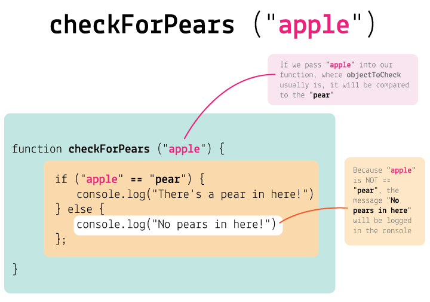
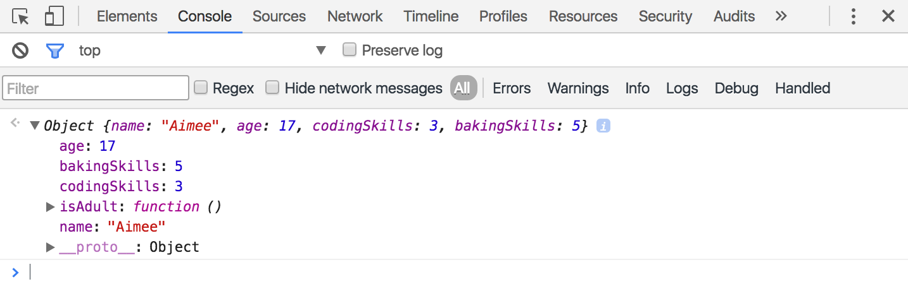

<!--

### The plan!

AM:

- [x] JS recap, yay!
- [x] JS demo: introduce `functions` and `if`, get people to use them in their Thimble apps
- [x] 30 minutes **wake-up activity**: 4 volunteers thingy (see day 2 notes towards the end `Back to the brief`)
- [ ] 1 hour **coding**: connect to DB & push data to it (repurpose v2)
- [ ] early lunch if this is taking longer than 1 hour

PM:

- [x] 30 minutes **group discussions & wireframing**: how can we all use these components but have different apps that server different purposes? what is the **potential** for apps using these components?

	* With these ingredients: dropdown, database, filter logic etc...
	* Come up with an app *recipe*!
	* **Wireframe two screens** and present them:
	
		1. How do you display the results coming back from the db (aka *search results section*)?
		* When people click / tap on a result, what do you display (aka *single result section*)?

-->

# Coding and app-making for beginners 

## Day 3 AM

[Last week](../02) you learned how to use **HTML and CSS** to style fancy buttons, dropdowns and lists.

We also discussed *programming-vs-coding* and took a look at JavaScript (aka **JS**) for the first time. We used the JS **Console** to "speak" with our browsers, introducing the building blocks of programming: *variables*, *functions* and *logic*.

But don't worry if it all seems a little blurry one week on...

**Today** we'll start from those concepts, and put them into practice by connecting your app to an online **database**.


# JavaScript essentials

<!--JavaScript can look a little scary at first.--> 

Let's look at some key *tools*, before we dig into your app code:

1. [Variables](#variables)
* [Objects](#objects)
* [If statements](#if-this-then-that)
* [Functions](#functions)
* The [Console](#console)


## Variables

Variables are like *boxes* where you can store data. 

To create a variable, you write

```javascript
var
```
		
then give it a **name** 

```javascript
var fruit
```

and put its **value** after the `=` sign

```javascript
var fruit = "apple";
```

Now your variable is called `fruit` and has an `apple` inside it.

<!--
#### How to use a variable

To use a variable, we must 

1. *declare* it: give it a **label**
* *assign* it: give it a **value**
-->

### How do you name variables? 

* Variable names should be **clear and meaningful**: `fruit` is better than `f`
* Variable names should begin with letters, `$` or `_` and only contain letters, numbers, `$` and `_`
* Variable names are **case sensitive**, which means that `myFruit` is different to `myfruit` or `MyFruit` or `MYFRUIT`
* Variable names cannot have spaces, so you can use [*camel case*](http://en.wikipedia.org/wiki/CamelCase) for variables like `userTelephoneNumber`, which is easier to read than `usertelephonenumber`.

## Objects

**Objects** are a special type of *variable*, which stores several pieces of information at once. 

It is useful to keep things organised.

To create an object, you *declare* a variable as usual with `var` followed by a name and `=`, and then you put a pair of *curly brackets*.

<!--
 to surround **key-value** property pairs:

```js
var objectName = { 
  propertyName: propertyValue,
  propertyName: propertyValue,
  ...
};
```
-->

```js
var person = {};
```

You can then add **properties** to the object like this

```js
person.name = "Aimee";
person.age = 17; // would you believe it?
person.codingSkills = 3;
person.bakingSkills = 5;
```

### How do you access objects?

An object is not useful unless we can look inside it and grab the *values* of its *properties*. 

You can do that in two ways using *dot notation*, where you write the name of the variable, followed by a `.` and then the property name

`person.name`

## Comparing data

JavaScript is very good at comparing data. 

Say we wanted to know whether `name` of a `person` was `Matteo`:

```js
person.name == "Matteo"
```

In English, this would translate to: if value of `name` is equal to `Matteo`, then spit out `true`. And if not, spit out `false`.

Notice this subtle but important difference:

1. `=` is to **store** data
*  `==` is to **check** if two things are the same

### If *this* then *that*
	
You may want your app to do different things depending on the result of a comparison. For instance:

```javascript
if (person.age < 18) {
	alert("You are not technically an adult")
} else {
	alert("But are you really an adult?")
};
```
		
So, **if** the `age` property of `persons` is lower than `18` the browser will pop up an alert saying `You are not technically an adult`. Otherwise (aka **else**) if `age` is equal or bigger than `18`, the alert will say `But are you really an adult?`.

This is really handy for searching through databases. For instance, when you search for something on Google, they use lots of *if statements* to sort through all the millions of pages to find results that match your search words.

## Functions
	
Functions are sets of instructions, packaged nicely for us to use over and over. 

Functions make code **reusable**. 

<!--
For instance, you could make a function to teach a *robot* how to `drink` something. The steps required to perform a drinking task remain the same, no matter what the robot is drinking.

```javascript
robot.drink("tea");
robot.drink("water");
robot.drink("coffee");
``` 
-->

Remember, you use functions of sorts everyday to do simple tasks. For instance, to *make tea*!

A function for making tea might have these steps:

1. Are there teabags? 

	If not: exit the function. No tea this time :(
	
	Else: continue...
* Fill the kettle with water (we assume there is a working kettle, and we have access to water)  
* Turn the kettle on.
* Is the water boiling? 
	
	If not: wait `X` seconds and then check again...
	
	Else: continue...
* Get a clean cup (we assume there is one and it's in your reach)  
* Put the teabag in the cup 
* Pour `Y` ml of water in the cup.
* Is the cup full?

	If not: go to the previous step (that is, pour some more water)
	
	Else: proceed to the next step 
* **Return** the tea!

<!--
 look like this (not actual JS, just the logical steps)

```
function makeTea ( whichTea, howMuchSugar, howMuchMilk ) {   
	1. check for teabags of whichTea type   
	2. fill the kettle   
	3. boil the water   
	4. get a clean cup   
	5. put teabag in the cup 
	6. if howMuchSugar is more than zero, and we have sugar, then add howMuchSugar to the cup
	7. if howMuchMilk is more than zero, and we have milk, then add howMuchMilk to the cup  
	8. return the tea! 
}
```
-->
 
It would be exhausting for us to explain all of those individual steps every time we wanted to ask someone for a cup of tea!

Likewise, if you want your app to perform a set of actions more than once, it makes sense to wrap those actions in a function. 

For example, you can *declare* a function that checks the `age` of a person:

```js
function isAdult(age) {
	var answer;
	if (age < 18) {
	 	answer = "no";
	} else {
	 	answer = "yes";
	} 
	return answer;
};
```

The code above *explains* to your app how to check if someone is an adult.

You can then run that function on some actual data:

```js
isAdult(16); // returns "no"
isAdult(23); // returns "yes"
isAdult(person.age); // returns "yes" or "no", depending on what you have actually stored in person.age
```

So, to use a function you must

1. *Declare* it: give it a **name** and teach the computer all the **steps** required to perform it
2. *Call* it: tell the computer to **execute** the code inside the function, by writing its name followed by *round brackets* `()`	

	In between *round brackets* `()` we can pass one or more *variables* to the function.

<!--	
	If we call the `checkForPears()` function and pass through `"apple"` as our variable (in the `objectToCheck` spot), then JavaScript will execute the instructions placing `"apple"` wherever `objectToCheck` was. The process (although we can't see it happening) would be something like this:
	
	
	
More examples:

```javascript
checkForPears("banana");
checkForPears("coconut");
checkForPears("plum");
var lastFruitInTheFridge = "kiwi";
checkForPears(lastFruitInTheFridge);
```
-->

The variables we *pass* to a function in between *round brackets* `()` will be used inside the function as the temporary value for `age`.

Variables inside a function are very useful, because they make the function **reusable**.

<!--
### Arguments

`checkForPears` is a **reusable** function. What makes it **flexible**?

It's `fruit`, a [variable](#variables) which lives inside the `checkForPears` function.

`I'm hungry` and `I need a nap` are called **arguments** ([don't argue, that's what they're called](http://programmers.stackexchange.com/questions/186293/why-are-actual-parameters-called-arguments)) and they are the actual values that we *pass* to a function.
-->
<!--
#### What happens in a function, stays in a function

There's another powerful thing we can do with functions: we can use them to take in some values, *compute* them, and then *return* a new value.

```js
function areYouAnAdult(age) {
	var answer;
	if (age < 18) {
	 	answer = "no";
	} else {
	 	answer = "yes";
	} 
	return answer;
};
```

`return` does two things: 

1. it gives a value back
2. it immediately exits the function

```js
areYouAnAdult(16); // returns "no"
areYouAnAdult(23); // returns "yes"
```

Without `return` we wouldn't know the answer!
-->


### Functions in objects

Objects can contain functions! 

Remember the `person` object?

See how it might look with some functions inside.

```js
person.isAdult = function() {
	var answer;
	if (this.age < 18) {
	 	answer = "no";
	} else {
	 	answer = "yes";
	} 
	return answer;
}
```
<!--
Which parts are the functions?

What would happen if we wrote `cat.drink( water )`?
-->

## Console

[Last week](../02#meet-js) we played around with JS using the browser Console.

We don't normally write JS in the Console. Instead, we write our JS programs in a code editor like Thimble (or [Sublime](http://www.sublimetext.com), [Brackets](http://brackets.io) etc) and store them as `.js` files. 

The Console is an essential **testing tool** for people who write JavaScript. 

Why do we need it? Because **JS is invisible**.

When we write HTML and CSS, we can see the results of our code rendered by the browser. 

**JS instead doesn't show up on the page**! It does a lot of stuff behind the scenes (like loading, sorting, storing and comparing data) which we can't see. 

When writing JS, it is very useful to check that our code is running properly, that it doesn't have errors, and that it has all the data it needs at the right time.

Using the Console, we can make JS *visible*. In other words, we can get JS to leave some *traces* inside the Console.

For example, you can use the Console to check what's inside your `person` object by writing this...

```javascript
console.log( person );
```

... which will display everything that's inside `person` in the Console.



Click the `➤` next to `Object` to open the object up and see what's inside it.

You could also check if the person is an adult
```javascript
console.log( person.isAdult() );
```

Puzzled? Don't worry, you'll understand why the Console is useful the first time your JS code breaks, and the Console will tell you exactly *what* the *error* is and *where* to find it! 


# Back to the brief

### Make an app that helps people sort through heaps of data to **find who/what they are looking for** 

<!--(eg: people in their community to do something together).-->

Remember the [computational thinking](../02#computational-thinking) method?

1. First we'll break down the brief into smaller chunks, *specifying* how each one could work. This process is what **designing algorithms** is about. 
* Once we have a good understanding of how our app will behave, we can **code** those algorithms.

## First: break down the brief

We need four volunteers (and post-its). 

1. The **user** (talks only to HTML)
2. The **HTML** character (talks only to the user, on request)
3. The **JS** character (can talk to both HTML and database)
4. The **database** character (talks only to JS, on request)

HTML and JS are siblings or colleagues (they are part of the same app) so they should stand closer, maybe hold hands :)

Let's play out the app behaviour. 

<!--Question: Should JS load data immediately or wait for user input? That is, should we wait for a shopping list or buy the whole store?-->

<!-- If the dataset is small, we may as well load it all and then present only what users ask for. This way they won't have to wait.. -->

1. **Load data** and store it in the app *memory*
* Capture **user input**
* **Filter and sort data** according to user choices
* **Output** filtered+sorted data


## Then: code the algorithms

Go to [thimble.mozilla.org](https://thimble.mozilla.org/) and log in. Then open your project from last week. 

Create a new file and call it `app.js`.

Like with CSS, we need to tell `index.html` to load our JS file.

In the `head` of `index.html`, add a `script` and point it to `app.js` like so:

```html
<head>
	...
	<script src="app.js"></script>
</head>
```	

Now that your JS file is connected to `index.html` you can write your JS code in `app.js`. The browser will read and execute it every time you load/refresh your app.

<!-- Do a console.log first -->

### 1. Load data and store it in the app memory

We're going to use a cloud-based real-time **database** service called [Firebase](https://www.firebase.com). There are several other solutions, including building your own database, however we chose Firebase because of its performance, features and good documentation. 

Many companies use Firebase to rapidly prototype app ideas, without investing time and money on database infrastructure and software.

#### *Where* is our data?
	
We need to know where to load data from, that is we need a **URL**. You can think of it as the address or phone number of your data.

[appsfromscratch.firebaseio.com/demo-app](https://appsfromscratch.firebaseio.com/demo-app)

<!--
> Heads up! We're using **public data** to make things simpler (avoiding authentication procedures, data security measure etc.) so make sure you don't add sensitive information to the database.
-->

In `app.js`, you can store that URL as a *variable*:

```javascript
var databaseURL = 'https://appsfromscratch.firebaseio.com/demo-app'
```

Your browser can do [many things out-of-the-box](https://developer.mozilla.org/en/docs/Web/API), for instance: giving you scarily accurate geolocation coordinates, playing audios and vides, doing maths, convert text into voices etc. Yet your browser doesn't know how Firebase works, because Firebase doesn't come pre-installed. 

Before you can use Firebase in your app, you must **install the Firebase JS library**. Do that by adding the following `script` to the `head` in `index.html`, just before the `script` pointing to `app.js`

```html
<head>
	...
	<script src="app.js"></script>
	<script src="https://cdn.firebase.com/js/client/2.4.0/firebase.js"></script>
</head>
```

Now that your browser knows what Firebase is and how it works, you can create a `database` *variable* as a new instance of `Firebase` and point it to our own `databaseURL`. 

In `app.js`:

```javascript
var database = new Firebase(databaseURL);
```

Then create another *variable* to store only the data you need in your app.

```javascript
var peopleList = []; // an empty list, for now 
```

Next you can instruct `database` to load data and store it in `peopleList`:

```javascript
// load data, see the Firebase manual https://www.firebase.com/docs/web/guide/retrieving-data.html#section-event-types
database.on('child_added', function(child) 
{
	var personData = child.val() 
  // "push" is JavaScript's lingo for "add to a list"
  peopleList.push(personData) 
})
```

The JS code above, in plain English:

* Hey database!

* For each *child*, do the following steps:

	* Create a variable `personData` and store the value of `child` in it
	*  Add `personData` to `peopleList`
	* Repeat until you've gone through all the *children*

* Thanks!
 
At this point, we can use the Console to check if `peopleList` has been loaded with data.


# Recipe for apps

By now, we all should have an idea of the *ingredients* we'll use to create our app prototypes:

* **input interface**, that is *dropdowns*, *text fields*, *buttons* etc.
* a **database** 
* some **filter logic** to sort through our data and make it accessible

### Challenge

How can we use these same *ingredients* to create different apps that serve different purposes? What is the **potential** for apps using these *ingredients*?

With those *ingredients* in mind, come up with an app *recipe*!

1. Brainstorm a few ideas, no matter how whacky they are and jot them down (a few words or a sentence per idea).
* Pick your favourite idea, and consider:

	* What is the **data unit**? 
	
		For example, in our demo app the *data unit* is a person and in the database we're storing people's profiles. If you're making a recipes app, the *data unit* will be a recipe.  

	* What pieces of information will your *data unit* feature? Which one of them will be used to filter & sort through heaps of data? 
	
		For example, in our demo app for each person we're storing `name`, `blurb`, `profile picture`, `likesPets` (which will help us filter data for the *I'd like someone to keep my pet* option), `bakingSkills` (which will help us filter data for the *I'd like someone to bake a cake* option) etc.
	

# Wireframes

Before they write any code, designers and developers **visualise** their ideas through *wireframes*.

#### Is *this* a wireframe?


#### Is *this* a wireframe?


#### Is *this* a wireframe?


#### Is *this* a wireframe?


#### Wireframes are like maps

Just like a map is an abstraction of a place that helps us describe its location and geography, **wireframes are abstractions** of the **structure** of an interactive system and the **relationships** between its components.

#### Wireframes are tools to **communicate your ideas**.

Depending on what stage your idea is at, your wireframes will be more or less detailed.

In any case, wireframes shouldn't look *finished*.

Paper wireframes get **more feedback** that digital ones, because people are less afraid to touch them, move them around, scribble notes on them. They don't look finished.

####  Wireframes are about **content**, **context** and **interaction**. 

* Use **real content**, never *lorem ipsum*. 
	
* **Words** are key. [Interface design is copywriting](https://gettingreal.37signals.com/ch09_Copywriting_is_Interface_Design.php)
	
* Think about **button labels**, how do you label user actions: is it `Share` or `Post` or `Publish` or `Say it!` or `Broadcast` for instance?  

#### Wireframes are **NOT about style**. 

When wireframing, don't worry about *colours*, *graphics* and *typography*.

### Your turn!

On the paper template, **wireframe three interfaces** and present them:

1. The interface with the **filter criteria** (aka *input section*)
* The interface that **displays the results** coming back from the db (aka *search results section*)
* The interface triggered when people click / tap on a result (aka *single result section*)

You can download more wireframing templates from [Interface Sketch](http://www.interfacesketch.com).

[](http://www.interfacesketch.com)


### License

[](http://creativecommons.org/licenses/by-nc-sa/4.0)

This work is licensed under a [Creative Commons Attribution-NonCommercial-ShareAlike 4.0 International License ](http://creativecommons.org/licenses/by-nc-sa/4.0)
