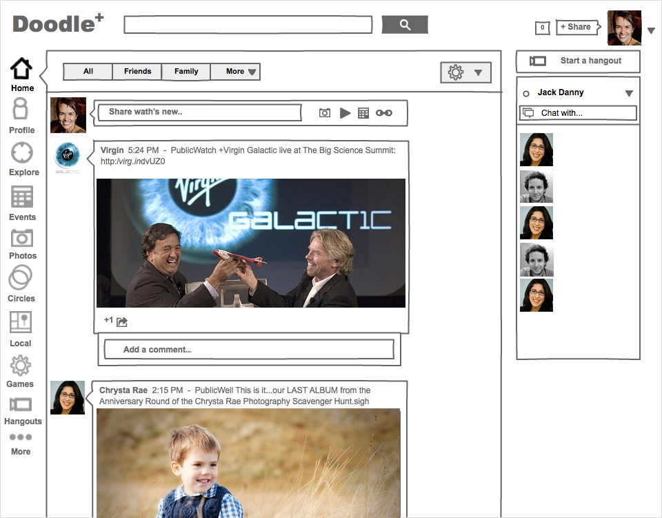

AM:

- [x] 30 minutes **wake-up activity**: 4 volunteers thingy (see day 2 notes towards the end `Back to the brief`)
- [x] JS recap, yay!
- [x] JS demo: introduce `functions` and `if`, get people to use them in their Thimble apps
- [ ] 1 hour **coding**: connect to DB & push data to it (repurpose v2)
- [ ] early lunch if this is taking longer than 1 hour

PM:

- [ ] 30 minutes **group discussions & wireframing**: how can we all use these components but have different apps that server different purposes? what is the **potential** for apps using these components?

	* With these ingredients: dropdown, database, filter logic etc...
	* Come up with an app *recipe*!
	* **Wireframe two screens** and present them:
	
		1. How do you display the results coming back from the db (aka *search results section*)?
		* When people click / tap on a result, what do you display (aka *single result section*)?
- [ ] *Don't reinvent the wheel*: introduce coding libraries, talk about them but we don't need to use them (jQuery, Backbone, P5.js, D3.js, Aframe for VR etc.)
- [ ] **Not another demo**: give them written instructions to integrate code at their own pace (life of a programmer)
- [ ] bonus challenge?


# Coding and app-making for beginners 

## Day 3

[Last week](../02) we covered some **HTML and CSS**, styling our first screen with fancy buttons and dropdowns.

We also discussed programming-vs-coding and took a look at JavaScript (aka **JS**) for the first time. 

We used the JS **Console** to speak with our browser, creating alerts and started storing information in boxes called variables.

But don't worry if it all seems a little blurry one week on...

Today we'll break down the brief, cover some JavaScript and push data to our **database**.

<!--
1. [Workshop](#workshop): HTML & CSS recap.
* [Group task](#ux-research): UX research.
* [What is **programming**](#programming-vs-coding)?
* Meet **JavaScript**: connect your app to an online database. 
-->


# Back to the brief

### Make an app that helps people sort through heaps of data to **find who/what they are looking for** 

<!--(eg: people in their community to do something together).-->

Remember the [computational thinking](../02#computational-thinking) method?

1. First we'll break down the brief into smaller chunks, *specifying* how each one could work. This process is what **designing algorithms** is about. 
* Once we have a good understanding of how our app will behave, we can **code** those algorithms.

### 1. Break down the brief

We need four volunteers (and post-its). 

1. The user (talks only to HTML)
2. The HTML character (talks only to the user, on request)
3. The JS character (can talk to both HTML and database)
4. The database character (talks only to JS, on request)

HTML and JS are siblings or colleagues (they are part of the same app) so they should stand closer, maybe hold hands :)

Let's play out the app behaviour. 

<!--Question: Should JS load data immediately or wait for user input? That is, should we wait for a shopping list or buy the whole store?-->

<!-- If the dataset is small, we may as well load it all and then present only what users ask for. This way they won't have to wait.. -->

1. **Load data** and store it in the app *memory*
* Capture **user input**
* **Filter and sort data** according to user choices
* **Output** filtered+sorted data


# JavaScript recap

JavaScript can look a little scary at first. 

Let's remind ourselves of some key *tools*, before we dig into our app code.

### Variables

Variables are like *boxes* where we can store data. To create a variable, we write

```javascript
var  = 
```
		
Let's give it a name and put something inside it

```javascript
var fruit = "apple";
```

Now our variable is called `fruit` and it has an `apple` inside it.

<!--
#### How to use a variable

To use a variable, we must 

1. *declare* it: give it a **label**
* *assign* it: give it a **value**
-->

#### How do we name variables? 

* Variable names should be **clear and meaningful**: `fruit` is better than `f`
* Variable names should begin with letters, `$` or `_` and only contain letters, numbers, `$` and `_`
* Variable names are **case sensitive**, which means that `myFruit` is different to `myfruit` or `MyFruit` or `MYFRUIT`
* Variable names cannot have spaces, so you can use [*camel case*](http://en.wikipedia.org/wiki/CamelCase) for variables like `userTelephoneNumber`, which is easier to read than `usertelephonenumber`.

### Comparing data

JavaScript is particularly good at comparing data. Say we wanted to know whether there was a `pear` in our `fruit` variable:

```javascript
fruit == "pear"
```

In English, this would translate to: if the stuff inside `fruit` is equal to `pear`, then spit out `true`. And if not, spit out `false`.

Notice this subtle but important difference:

1. `=` is to store data
*  `==` is to check if two things are the same

### Console

[Last week](../02#meet-js) we played around with JS using the browser Console.

We don't normally write JS in the Console. Instead, we write our JS programs in a code editor like Thimble (or [Sublime](http://www.sublimetext.com), [Brackets](http://brackets.io) etc) and store them as `.js` files. 

The Console is an essential **testing tool** for people who write JavaScript. Why do we need it? Because JS is *invisible*.

When we write HTML and CSS, we can see the results of our code rendered by the browser. 

**JS instead doesn't show up on the page**! It does a lot of stuff behind the scenes (like loading, sorting, storing and comparing data) which we can't see. 

Yet, it is very useful when writing JS, to check that our code is running properly, that it doesn't have errors, and that it has all the data it needs at the right time.

Using the Console, we can make JS *visible*. In other words, we can get JS to leave some *traces* inside the Console.

For example, we can use the Console to check what's inside our `fruit` variable by writing this...

```javascript
console.log(fruit);
```

... which will display what's inside `fruit` inside the Console.

Still puzzled? Don't worry, you'll understand why the Console is useful the first time your JS code breaks, and the Console will tell you exactly *what* the *error* is and *where* to find it. 

### If *this* then *that*
	
We may want our browser to do different things for us depending on the result of a comparison. For instance:

```javascript
if (fruit == "pear") {
	console.log("There's a pear in here!")
} else {
	console.log("No pears in here, better luck next time!")
};
```
		
So, if our `fruit` variable has `pear` inside, the Console will say `There's a pear in here!`. But if there is no `pear` inside our `fruit` variable, it will say `No pears in here, better luck next time!`.

This is really handy for searching through databases. For instance, when you search for something on Google, they use lots of *if statements* to sort through all the millions of pages to find results that match your search words.

### Functions
	
Functions are sets of instructions, packaged nicely for us to use over an over. 

Functions make code **reusable**. 

<!--
For instance, you could make a function to teach a *robot* how to `drink` something. The steps required to perform a drinking task remain the same, no matter what the robot is drinking.

```javascript
robot.drink("tea");
robot.drink("water");
robot.drink("coffee");
``` 
-->

Remember, you use functions of sorts everyday to do simple tasks. For instance, to make tea!

A function for making tea might look like this (not actual JS, just the logical steps)

```javascript
function makeTea ( whichTea, howMuchSugar, howMuchMilk ) {   
	1. check for teabags of whichTea type   
	2. fill the kettle   
	3. boil the water   
	4. get a clean cup   
	5. put teabag in the cup 
	6. if howMuchSugar is more than zero, and we have sugar, then add sugar to the cup
	7. if howMuchMilk is more than zero, and we have milk, then add milk to the cup  
	8. return the tea! 
}
```
 
It would be exhausting for us to have to say out loud all of those individual steps every time we wanted to ask someone for a cup of tea!

Likewise, if we want to search through lots of variables to see if there's a `pear` inside, then we can use a function to carry out the repetitive task of going through many data points.

We can *declare* a function like this to do that job

```javascript
function checkForPears (fruit) {
	if (fruit == "pear") {
		console.log("There's a pear in here!")
	} else {
		console.log("No pears in here, better luck next time!")
	};
}
```

We have packaged our instructions into a function, which means we don't have to type out all that code every time we want to search through variables. 

<!--All we need to type is this:-->

```javascript
var myFavouriteFruit = "orange";
checkForPears(myFavouriteFruit);
```

Because we have no `pear` in `myFavouriteFruit`, the Console will log `No pears in here, better luck next time!`.

So, to use a function you must

1. *declare* it: give it a **name** and teach the computer all the **steps** required to perform it

	```javascript
	function checkForPears (fruit) {
		if (fruit == "pear") {
			console.log("There's a pear in here!")
		} else {
			console.log("No pears in here, better luck next time!")
		};
	}
	```
2. *call* it: tell the computer to **execute** the code inside the function, by writing its name followed by *round brackets* `()`	

	```javascript
	checkForPears("orange");
	```
	
In between *round brackets* `()` we can pass one or more *variables* to the function.
	
```javascript
checkForPears("banana");
checkForPears("coconut");
checkForPears("plum");
var lastFruitInTheFridge = "kiwi";
checkForPears(lastFruitInTheFridge);
```
	
The variables we *pass* to a function in between *round brackets* `()` will be used inside the function as the temporary value for `fruit`.

Variables inside a function are very useful, because they make the function **reusable**.

<!--
### Arguments

`checkForPears` is a **reusable** function. What makes it **flexible**?

It's `fruit`, a [variable](#variables) which lives inside the `checkForPears` function.

`I'm hungry` and `I need a nap` are called **arguments** ([don't argue, that's what they're called](http://programmers.stackexchange.com/questions/186293/why-are-actual-parameters-called-arguments)) and they are the actual values that we *pass* to a function.
-->

### What happens in a function, stays in a function

There's another powerful thing we can do with functions: we can use them to take in some values, *compute* them, and then *return* a new value.

```js
function areYouAnAdult(age) {
	var answer;
	if (age < 18) {
	 	answer = "no";
	} else {
	 	answer = "yes";
	} 
	return answer;
};
```

`return` does two things: 

1. it gives a value back
2. it immediately exits the function

```js
areYouAnAdult(16); // returns "no"
areYouAnAdult(23); // returns "yes"
```

Without `return` we wouldn't know the answer!


# Now onto our database!


<!--

- [ ] Now that people have experienced HTML, CSS and JS we could ask them to start thinking about their OWN app (user research)

# Choose a theme

A theme is something that you are passionate about, an issue that needs your help, or a problem that you notice in your community that resonates with you.

Example: *Create an app that helps your community learn about or contribute to {your project}.*

Start **brainstorming** some project ideas with your partner.
 
* Keep it simple and focus on solving a **single need**.
* **Don't spend too long** on any one idea because you will have time to further discuss your ideas later.
* Stay with the theme you choose.
* Share a few ideas with each other now and take note of them for later.


# Who are your users?

### Good practices for interviewing

1. **Plan**: prepare a script, know what to ask, and who to ask.
2. Recruit **strangers**. Because [homophily](http://en.wikipedia.org/wiki/Homophily)
3. [IF POSSIBLE] Go to **their place**, in a space where they're comfortable, best if the space where they use the product(s) you want to test / talk about. Let them show you around.
4. Easier if you interview **pairs** of users: they'll be less anxious.
5. **Listen**. Don't talk about yourself.
6. Be comfortable with **silence**: give people time and space to answer your question.
7. Be ready to **be challenged** and improvise.
8. Avoid **leading questions**. Try not to bias your interviewees.

	bad > `How much do you love using FB?`
	
	good > `Tell me about your most recent FB experience` (more concrete & memorable)
	
9. Avoid **closed questions**.

	bad > `Do you order A, B or C?`
	
	good > `How do you choose food when going out?`
	
10. Try **casual requests** instead of questions. For instance, instead of asking `How do you store your photos?` consider asking them to show you how they store photos.
    
   
   
Question examples:

* How did you first learn about `insert your topic`?
* How were you motivated to become involved in `insert your topic`?
* Tell me more about that experience. What do you remember most about it?
* (if the user has started telling you about a relevant experience) What did you enjoy most? What didn't you enjoy about it?
* What kinds of problems do you or your community commonly see in your experience? Have you thought about how you would solve it?   


    
### Interview analysis

* Take 5 minute to write 4-5 important observations on post-its notes about what people said and place them on the wall.
* What are the common themes you see emerge?
* What are the common problems you heard/observed?
* Did any of the findings make you start to think differently about your community and the problems you may have already been designing for?

You should now understand a little more about how interviewing your potential app users can be helpful and have some tools to help you go out interview your community. 

It takes some practice, but don't let that slow you down! 

**Repeat this activity with new potential users.** 

The more you know about your community and potential audience, the more you can respond by creating something valuable for them.


# Speed-sketch your ideas

* The goal is to get something down on paper, but not get too caught up in the details. 

* This is to help visualise some of your ideas. 

* Don't overthink the ideas or censor your thoughts. 

* The quality of your drawings and handwriting doesn't matter either.


Printable wireframing templates from [InterfaceSketch](http://www.interfacesketch.com)


1. **JavaScript**: [get our app to display data](#lets-code)
* [What is good design?](#what-is-design)  
* [Designing behaviours](#designing-behaviours) 
* [Wireframing](#wireframes)


# Let's code

> Make an app that helps people sort through heaps of data to **find who/what they are looking for** (eg: people in their community to do something together).

### 1. Break down the problem

1. Load data and store it in the app memory
* Capture user input
* Filter and sort data according to user choices
* Display filtered+sorted data

### 2. Code the algorithms

1. **Load data and store it in the app memory**
	
	* We need to know where to load data from, that is we need a **URL**. You can think of it as the address or phone number of your data..
	
	* Heads up! We're using **public data** to make things simpler (avoiding authentication procedures, data security measure etc.) so make sure you don't add sensitive information to the spreadsheet.
	
		```js
		var spreadsheetURL = 'https://spreadsheets.google.com/feeds/list/' + key + '/' + worksheet + '/public/values?alt=json'
		```
	
	See the [manual here](https://developers.google.com/gdata/samples/spreadsheet_sample?hl=en)
	
	* Copy-paste the URL into a new browser tab to check if it works and what data we're receiving from it
	
	* Integrate [loadData function](../../demo-app/loadData.js) to load data from a URL (we don't have to reinvent the wheel)
	
	* *Call* `loadData` and tell it where to ask for data (`spreadsheetURL`) and what to do once data is loaded (`getPeopleList`)
		```js
		loadData(spreadsheetURL, getPeopleList)
		```
	* Integrate [getPeopleList function](../../demo-app/getPeopleList.js)
	
		Introducing [arrays](#arrays) and [loops](#loops)
	
2. Capture user input

	* We can use jQuery to get the selected option. Let's try it in the console first
	
	```js
	$('select') // will grab the whole dropdown element
	$('select option:selected') // will grab the selected option from the dropdown
	$('select option:selected').val() // will return only the value (or text) for the selected option
	```
	
	* Let's create a reusable function to get the selected option
	
	```js
	function getSelectedOption() {

		var selectedOption = $('select option:selected').val()
		return selectedOption
	}
	```
	
	* **When** do we need to capture the selected option? When one presses the `button`.
	
	Let's teach our app to do that
	
	```js
	$('button').on('click', function() {
		var selectedOption = getSelectedOption()
		// and then we need to sort, filter and display data
	})
	```

3. Filter and sort data according to user choices

	```js
	function filterData(data, option) {

		var filteredData = [] // an empty array
		
		// loop through data
		data.forEach(function(person) {
			
			// depending on option, we add rows to filteredData
			// for example, if option is "Keep my pet" we add rows to filteredData only if person.likesPets is 'yes'
			// we wouldn't give our pet to someone who dislikes them would we?
			
			if (option == 'Keep my pet') {
				if (person.likesPets == 'yes') {
					filteredData.push(person)
				}	
			}
			// TODO check the other options..
		})

		return filteredData
	}
	```

4. Display filtered+sorted data
 
	```js
	function displayData (data) {

		// loop through data 
		data.forEach(function(person) {

			// use the template function to get a list item
        	var li = getPersonListItem(person)
        
        	// append the list item to our HTML
        	$('ul').append(li)

		})
	}
	```


# What is design?

**Design** is a response to an inquiry or a problem.

People don't come to your site/app to see your pretty design. 

### UX/UI design: same thing?

UI is like the seat of your car.
UX is the experience you get from that seat.

>UX design is about effectively addressing the needs and circumstances of your users, to produce interfaces that are comfortable and even joyful to use.


 

### What is good design?

Even though it looks gorgeous, it's not doing well what is made for.
 
Hot Berta is good example of bad user experience design.


### How to make good design?

Have a clear, **step-by-step process** to help you through the creation of your app

#### Research

**Thinking through** your ideas in detail helps identify potential problems, gaps in your knowledge, and assumptions before you dive into code.

Taking the time to step back and think about **audience** and explore **multiple ideas** will lead to a more successful solution
	
* What is your goal?
* Who is your audience? 
* What is the key issue you are addressing? 
	
#### Sketch

**Brainstorming** helps you to work with peers to kickstart an idea or concept for a design.


Sketch using pen and paper, write down different scenarios and *user journeys*.

#### Collaborate 

Ask other team, specialist, users. 

More brains are better than one.

#### Prototype & test

Process of understanding the product by trial and error.

**User testing** allows you to explore your assumptions and see what improvements need to be made to your design.

#### Iterate

Do more prototyping & testing. 

#### Launch & learn more

It's not end of the process.


# Designing behaviours

Not just interfaces.

We deal with interfaces, tools and devices, but what we design, ultimately, are **human behaviours**. 

We design means to **enforce**, **prevent** or **facilitate** behaviours.

### Persuasive interfaces

[](http://goodui.org/#9 "Telling who it's for instead of targeting everyone")

[](http://goodui.org/#4 "Social proof > testimonials")

[](http://goodui.org/#18 "Benefit Buttons instead of just task based ones")

[](http://goodui.org/#7 "Recommending instead of showing equal choices")

[](http://goodui.org/#30 "Loss Aversion instead of emphasizing gains")

[](http://goodui.org/#35 "Urgency instead of timelessness")

[](http://goodui.org/#36 "Scarcity instead of abundance")

[](http://goodui.org/#41 "Anchoring instead of starting with the price")

[](http://goodui.org/#44 "Smaller Commitments instead of one big one")

### Engaging interfaces

[](http://goodui.org/#48 "Natural Language instead of dry text")

[](http://goodui.org/#13 "Just enough input > gradual engagement")

[](http://goodui.org/#37 "Recognition instead of recall")

[](http://goodui.org/#14 "Exposing Options instead of hiding them")

[](http://goodui.org/#33 "Inline Validation instead of out-of-context errors")

[](http://goodui.org/#25 "Designing For Zero Data instead of just data heavy cases.")

[](http://goodui.org/#53 "Useful Calculations instead of asking to do math")

[](http://goodui.org/#8 "Undos instead of prompting for confirmation")

[](http://goodui.org/#52 "Thanking instead of simply confirming completion")

[](http://goodui.org/#58 "Set Collections instead of independent items")

[](http://goodui.org/#23 "Fewer Borders instead of wasting attention")

[](http://goodui.org/#47 "Icon Labels instead of opening for interpretation")

Also, check out animated examples of design patterns at [UseYourInterface](http://useyourinterface.com)


# Wireframes

Is *this* a wireframe?


Is *this* a wireframe?



Is *this* a wireframe?


Just like a map is an abstraction of a place that helps us describe its location and geography, **wireframes are abstractions** of the **structure** of an interactive system and the **relationships** between its components.

* Wireframes are about **communicating your ideas**.

* They are about **content**, **context** and **interaction**. 

	Use **real content**, not *lorem ipsum*. 
	
	**Words** are key. [Interface design is copywriting](https://gettingreal.37signals.com/ch09_Copywriting_is_Interface_Design.php)
	
	Think about **button labels**, how do you label user actions: is it `Share` or `Post` or `Publish` or `Say it!` or `Broadcast` for instance?  

* They're **NOT about style**. 

	When wireframing, don't worry about *colours*, *graphics* and *typography*. 


### Wireframes *with code*

> Standing on the shoulders of giants...

or

> Don't reinvent the wheel

Meet [Bootstrap](http://getbootstrap.com/), a framework to build mobile-first Web-apps and sites. It comes with a set of common *building blocks* to quickly put together interfaces

[](http://getbootstrap.com/)

[Divshot](https://architect.divshot.com/) and [Jetstrap](https://jetstrap.com/) are drag&drop interface builders based on Bootstrap, which you can use to make clickable wireframes.


### Wireframes *sans code* 

Using [Moqups](https://moqups.com/)

[](https://moqups.com)

-->


### License

[](http://creativecommons.org/licenses/by-nc-sa/4.0)

This work is licensed under a [Creative Commons Attribution-NonCommercial-ShareAlike 4.0 International License ](http://creativecommons.org/licenses/by-nc-sa/4.0)