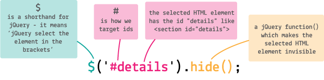

# Coding and app-making for beginners 

## Day 4 AM


[Last week](../03) you learned how to use **JS** to connect your app to an online **database**, **upload data** (aka `write`) and **download data** (aka `write`).

<!--You also started **wireframing** different app *recipes* using the same basic *ingredients*: interface inputs, a database and some filtering logic.-->

**Today** we'll begin with a JS quiz!

<!--,by recapping your JS code which *loads* data from Firebase, and we'll learn how to *upload* new data to Firebase.-->

We'll also introduce two magic words that you'll sprinkle across HTML, CSS and JS: `class` and `id`!

Then you'll start using **jQuery**, one of the most popular JS *libraries* (that is, collections of code to accomplish common programming tasks, generally free) to display data from Firebase in your app's interface. 

But first, a little recap!


# Quiz time!


1. *Java* and *JavaScript* are the same thing. 
	 	
	- [ ] true 
	- [ ] false 
	
	<!--False. They are two different programming languages. Java is the language behind Android (and many other things), JS is the "native" language of the Web.
	Java and JavaScript are like "car" and "carpet".. similar words, different meanings.-->
* What is wrong with this JS code?

	```js
	var userName = 'Jo";
	```
	
	<!--Quotation marks must match. You either use double or single quotes. So, 
	
	var userName = "Jo";
	
	or 
	
	var userName = 'Jo';-->
* What is wrong with this JS code?

	```js
	var person = { };
	person name = 'Jo';
	```
	
	<!--Properties inside objects must be accessed via . (dot notation) so
	
	person.name = 'Jo';--> 		
* What will this JS code produce?

	```js
	person.drink = function ( beverage ) { 
		alert ( "I am drinking " + beverage + "!" ); 
	}
	
	person.drink( "coconut water" );
	```
	
	<!--An annoying pop-up saying "I am drinking coconut water!"-->
* What will this JS code produce?

	```js
	person.whisper = function ( message ) 	{ 
		console.log ("Sshhh... " + message ); 
	}
	
	person.whisper( "Keep calm and code on" );
	```
	
	<!--A message in the browser's JS Console (one of the most useful developer tools) saying: "Sshhh... Keep calm and code on"-->
* What will this JS code produce?

	```js
	function areYouAnAdult ( age ) {
  		var answer;
    	if (age < 18) {
     		answer = "no";
    	} else {
     		answer = "yes";
    	} 
    	return answer;
	}
	
	areYouAnAdult( 18 );
	```
	
	<!--It will return "yes"-->
* Where is better to put JavaScript `<script src="example.js"></script>` in your HTML?

	- [ ] inside the `head`
	
		```html
		...
		<head>
			...
			<script src="example.js"></script>
		</head>
		<body>
			...	
		```
		
	- [ ] at the end of the `body`
	
		```html
		...
		<body>
			...	
			<script src="example.js"></script>
		</body>	
		```
	
	<!--Both are fine, however end of body is recommended, because your JS may need the body (with all its content) to be loaded first, and then it can execute properly-->	

 
<!--
Inspirations  for the JS quiz
https://www.khanacademy.org/computing/computer-programming/html-css-js/html-css-js-intro/e/quiz--javascript-recap 
http://tonyfreed.com/blog/top_javascript_interview_question_2015
-->

### Spot the usual suspects

> Go to [thimble.mozilla.org](https://thimble.mozilla.org/) and log in. Then open your project from last week. 

> In `app.js` can you spot *variables*, *functions* and *objects*?

### **Comment** your code to make sense of it

Translating JS into your own plain-English comments will help you make sense of your code. Even after years of JS development (and despite English not being Matteo's mother tongue) we find reading English much easier than JS :)

In JS you can write a comment using double forward-slash `//` (without spaces between the two slashes)

```js
// this is a JavaScript comment
var databaseURL = 'https://codeyourapp.firebaseio.com/';
``` 

or using `/*  ...  */` if you want to comment out multiple lines at once (useful sometimes)

```js
/*
person.whisper = function ( message ) 	{ 
	console.log ("Sshhh... " + message ); 
}

person.whisper( "Keep calm and code on" );
*/
```

> Read through your JS code line by line, and write comments so that you have an English *translation* of the JS you wrote. 

### **Indent** your code

One of the most common beginner mistakes is missing brackets.

How do you make it easier to read your code and spot such mistakes? 

Compare the two examples of HTML below. Which is easier to read?

Example A:

```html
	<body>
<h1>Short title</h1>
<p>In this example, we have a relatively long paragraph. With longer content inside our element, we want to make it as easy as possible to differentiate between our code and our content. If we don't indent our code, you can see how it becomes harder to spot where our p element starts and where it ends.</p>
	<p>Indentation is also useful to spot errors in our code such as missing brackets or unclosed tags.</p><p>A good practice is to have both the opening and closing tags of the element aligned, with the inner content indented on a new line.</p></body>
```

Example B:

```html
<body>
	<h1>Short title</h1>
	<p>
		In this example, we have a relatively long paragraph. With longer content inside our element, we want to make it as easy as possible to differentiate between our code and our content. If we don't indent our code, you can see how it becomes harder to spot where our p element starts and where it ends.
	</p>
	<p>
		Indentation is also useful to spot errors in our code such as missing brackets or unclosed tags.
	</p>
	<p>
		A good practice is to have both the opening and closing tags of the element aligned, with the content indented on a new line.
	</p>
</body>	
```

The second example uses **indentation**. That means giving your code a consistent **visual structure** by pushing lines left or right. 

Indenting your code makes it easier to:

* differentiate between code and text/content
* understand how code is structured, as nested elements are also *visually* nested
* spot if you've missed something, as start `<p>` and end `</p>` are *visually* aligned

> Open `index.html` of your app.

> Starting from the top of the document, select one or more lines of code, then use <kbd>cmd</kbd> + <kbd>]</kbd> to move your selection to the right, or <kbd>cmd</kbd> + <kbd>[</kbd> to move your selection to the left.

> Go through *all* your HTML until it's tidy and legible. 

In CSS, the *best practices* are much debated. On the whole, it's essential to open and close your brackets `{}`, then inside them on a new line, place your *indented* styles like so:

```css
h1 {
	text-align: center;
}
```

Or so:

```css
h1
{
	text-align: center;
}
```

How **NOT** to do it:

```css
h1{text-align: center;}
```

If your code is not indented, it can be *really easy* to miss out a bracket or semi-colon, then spend half an hour trying to figure out why the page is broken!

<!--There is no right or wrong way, use whichever way you find more comfortable to read.-->

> Open `style.css` of your app.

> Starting from the top of the document, select one or more lines of code, then use <kbd>cmd</kbd> + <kbd>]</kbd> to move your selection to the right, or <kbd>cmd</kbd> + <kbd>[</kbd> to move your selection to the left.

> Go through *all* your CSS until it's tidy and legible. 


<!--
### Firebase said so

When using a service like Firebase, we need to follow some of *their* rules and conventions, which are all explained in their code *manual*, aka the **docs**: [firebase.com/docs](https://www.firebase.com/docs)

For example, Firebase provides us with a `.val()` function to extract data *objects* from what they call a `child`.

It wouldn't work if we tried a different function name, like `.value()` or `giveMeTheData()`.

**A large part of a coder's work is reading docs** (or if you're like us, *skimming through* them) to learn how the services you are using are meant to be handled. This is no different than a plumber reading a boiler's manual before she works on it. 

Remember: you are not expected to know how everything works! 

Instead of stuffing your head with specific code instructions, you can learn how to quickly find what you need in the docs, and apply it to your code. 

What often determines the success of a tech startup like Firebase is how their code is documented. If it has good docs, then more developers are going to use it.
-->


# Be specific!

So far in your CSS experiments you changed the look & feel of the different parts of your HTML. 

You *selected* headings using `h1`, paragraphs with `p`, buttons with `button` and dropdowns with `select`.

In your CSS you may have something like this:

```css
p 
{
	color: grey;
	font-size: 20px;
	text-align: center;
	/* this is a CSS comment */
}
```

The block of CSS code inside curly brackets `{}` applies to **every paragraph** `p` in your HTML. 

### `class` attribute

Targeting your elements by simply using their name (like `p`, `h1` and so on) has worked fine up until now.

But... 

* What if you want to apply different styles to different paragraphs `p`?
* What if some of the same styles are applied to several elements, and you find you're repeating yourself?

In HTML you can use `class` to *classify* your elements, and in CSS you can target those elements to give them different styles. 

In your HTML opening tags, add in `class="  "` with your own class names inside the `" "`. You can **add as many classes as you want**, separated by a space:

```html
<p class="textCentred specialText" > Swap skills or time with people in your area </p>
<p class="textCentred" > Just pick an option from the dropdown to get started </p>
``` 

Above, there are two classes added to the first `p` - `textCentred` and `specialText`.

You could call them whatever you like: **class names are entirely up to you**. However, it makes sense to give them descriptive short names.

In CSS, target these classes using a dot `.` before the class name, like so:

```css
.textCentred
{
	text-align: center;
}

.specialText
{
	color: pink;
}
```

Now you can use `textCentred` to centre other elements instead of having to create or add the style `text-align: center;` to every single element you want centred. 

```html
<h1 class="textCentred">I'd like someone to...</h1>
```

Likewise the second class `specialText` can be used to turn the text inside any element pink.

Classes are useful for **shared rules**.

### `id` attribute

Whilst classes are used for shared rules, sometimes it's important to **get super, super specific**!

Adding an `id` is like giving an element a name of its own. 

For example, IF `animal` were an HTML element (stay with us here...) you could write something like this:

```html
<animal class="mammal dog" id="Sparky" > </animal>
<animal class="mammal cat" id="Bruno" > </animal>
```

As you can see, the two animals share a class `mammal` and have other, more specific classes: `dog` and `cat`. Their **unique** name is inside the `id` attribute.

<!--In the dog world, a dog is the `element`, its `class` could be dalmatian and it's `id` could be Sparky.-->

Giving an element a unique `id` allows you to style it differently from any other instances of the same element on the page. It is important that **no two elements on the same HTML** have the same `id`. In other words, `id` must be unique. 

```html
<p class="textCentred" id="instructions" > Just pick an option from the dropdown to get started </p>
```

In CSS, target ids using a hash `#` before the id name, like so:

```css
#instructions
{
	color: black;
}
```

Ids are the most powerful CSS selectors: the styles you apply to them override all other styles.


# Let's code!

<!--- [ ] wrap everything in `<section id="home"> </section>`
- [ ] create another section for `details`-->

<!--### Sections-->

Your app prototype will have two sections:

1. **Home** section with dropdown menu, `Find` button and search results
* **Details** section for each item in the search results 

### The `#home` section

Let's finish off the home section interface.

You've already created two separate `section`s inside your HTML. One of those sections contains the `dropdown`, the find `button` and the results list with placeholder content inside.

```html
...
<body>
	<section>
		<h1>I'd like someone to...<h1>
		<select>
		      <option>Bake a cake</option>
		      <option>Move my furniture</option>
		      <option>Keep my pet</option>
		</select>
		<!--etc etc...-->
	</section>
</body>
```

> Give the first `section` (which contains the `dropdown` menu) an `id="home"`

>```html
<section id="home">
	<!-- etc etc...-->
</section>
``` 

### The `#details` section

Underneath the `<section id="home"> ... </section>` you should already have an empty `<section></section>`.

> Give this `section` an `id="details"` and make some space inbetween the opening and closing tag.

>```html
<section id="details">
</section>
``` 

> Inside `<section id="details"> ... </section>` create a new `<div id="person"></div>`. This will be the *details* screen, where a selected person's profile will be displayed.

In the `#home` section you created an unordered list `ul` with list items inside `li`. Within those you put an image `img`, a heading 2 `h2` and a paragraph `p`.

We're going to use that `img`, `h2` and `p` in `#details`. 

> Copy the `img`, `h2` and `p` from the `li` in `#home` and paste them inside `<div id="person"> </div>` like so

> ```html
<section id="details">
	<a id="back">Back</a>
	<div id="person">
		
		<h2>
			Aimee
		</h2>
		<p>
			I like code and cake
		</p>
	</div>
</section>
```
   
Your users may want to move back and forth between `#home` and `#details`. For that you'll need a `Back` button!
 
> Add in `<a id="back">Back</a>` above `<div id="person">`

> ```html
<section id="details">
	<a id="back">Back</a>
	<div id="person"> 
 	...
``` 
	
Your users will also need a way to contact the person. Add in a contact button inside your `#person`: `<a class="contactButton">Contact Aimee</a>`

> Your `<section id="details"></section>`  will look something like this:

```html
<section id="details">
	<a id="back">Back</a>
	<div id="person">
		
		<h2>
			Aimee
		</h2>
		<p>
			I like code and cake
		</p>
		<a class="contactButton">Contact Aimee</a>
	</div>
</section>
```

### One more thing: **values**!

<!--There's *one more thing* you need to add to your **HTML**. -->

How does **JS** know which data to ask from the **database**, after a **user** has picked an option from the dropdown?

To let JS know which data to look for, we can add a little bit of information to each `option` in our HTML dropdown.

> Scroll back up to your `select` dropdown menu in `#home`. In each opening `option` tag add in `value=" "`

> ```html
<select>
     <option value=" ">Bake a cake</option>
     <option value=" ">Move my furniture</option>
     <option value=" ">Keep my pet</option>
</select>
```

The `value` attribute will contain the property which relates to the selected option - the exact spelling you use in your database. 

For example, if the user selects `Bake a cake`, the property which matches that is `bakingSkills`.

> Open your Firebase database at [codeyourapp.firebaseio.com](https://codeyourapp.firebaseio.com/) and take a look at the data you've stored in there. 

> Copy property names from the database and paste them in the relevant value slot in your HTML. Make sure to double-check for the exact property names, otherwise your JS code will not work!

> ```html
<select>
     <option value="bakingSkills">Bake a cake</option>
     <option value="bodyStrength">Move my furniture</option>
     <option value="likesPets">Keep my pet</option>
</select>
```


# Coding and app-making for beginners 

## Day 4 PM

<!--# Don't reinvent the wheel -->

### Code *libraries* 

Aka `Don't reinvent the wheel`.

Code libraries are **collections of pre-written functions** which you use to avoid re-writing the same code over and over again.     

<!--   
There are millions of libraries out there. 

Here are some of the most popular in the industry:

- [jQuery](https://jquery.com)   
- [Bootstrap](http://getbootstrap.com/) Ready-made interface components
- [Greensock](https://greensock.com/) Animationzzz
- [Google Material Design](http://www.getmdl.io/index.html) Design template
   
Some other advanced libraries:   
   
- [p5.js](http://p5js.org/gallery/) Advanced drawing library 
- [three.js](http://threejs.org) 3D rendering library
- [aframe](https://aframe.io/examples/showcase/sky/) 360 VR library
-->

One of the first libraries we recommend you get familiar with is jsQuirrel... :squirrel:

### Meet jQuery


<!-- John Resig, jQuery and the Open Source Process by Andreas Dantz on Flickr https://www.flickr.com/photos/szene/6227426946 -->

The [first version of jQuery](http://ejohn.org/files/jquery-original.html) was written in 2006 by a guy called John Resig. He noticed how he was using the same JS functions over and over, across different projects. So he put together a JS toolkit, aka a *library*, and since it was working well for him, he decided to share it with the NYC Web dev community, and then with the rest of the WWW. 

Over the years, jQuery has been peer-reviewed and enhanced by thousands of developers. It is currently the [the most popular JavaScript library](http://trends.builtwith.com/javascript) on the Web, with ~78% of the top 1 million websites using it! 

And it's FREE!

[](https://jquery.com)

> John made a point of listening carefully to the *community* and incorporating feedback from those interactions which made both the code and *documentation* better.

<!-- https://blog.jquery.com/2016/01/14/ten-years-of-jquery-and-beyond/ -->

#### What is jQuery for?

jQuery makes it easy to **select** HTML elements and *manipulate* them, for example hiding, showing, moving around and changing the content of a bunch of HTML elements.

#### How does jQuery work?

jQuery uses CSS-like **selectors**.

For example, if you want to select all `h1` elements in your HTML, you can do it like this

```js
jQuery('h1');
// notice the lowercase j and capital Q in jQuery
``` 

...which is the equivalent of telling your browser to `select all h1 elements in the HTML`.

You can then apply functions that **manipulate** those selected elements. 

For example, if you want to hide all `h1` elements in your HTML, you can do it like this

```js
jQuery('h1').hide();
``` 

So to recap:

1. Select
* Manipulate 

It's common practice to store a jQuery selection in a *variable*, and then use that variable throughout your code. That way you don't have to select the same HTML elements over and over again.

```js
var h1 = jQuery('h1');
h1.hide();
h1.fadeIn();
```

#### Dollar$

There's a saying that goes like this: 

> A good programmer is a *lazy* programmer.

In practical terms, it means that programmers really like their **shortcuts**. 

There's a shortcut for jQuery too, and it's `$`

`$('h1')` achieves the same as `jQuery('h1')` and it saves you 5 key strokes! :squirrel:

#### Making stuff happen on demand

This is what makes *programming* languages (like JS) so much more powerful than *markup* languages (like HTML). 

Programming has something to do with the *future*: you define instructions and *behaviour* that will happen in the future, *if* and *when* something specific happens.

For example, you may want to `hide` an element when you `click` on a button. Using jQuery, you can do it like this

```js
// select the button element(s)
var button = $('button');

// select the h1 element(s)
var h1 = $('h1');

// when someone clicks the button, hide the h1
button.click( function () 
{
	h1.hide();
});
```


# Your turn

### 1. Load jQuery

We created a handy document with snippets of code for you to **copy-paste**: [bit.ly/copyPasteCodeYourApp](http://bit.ly/copyPasteCodeYourApp)

> Go to [bit.ly/copyPasteCodeYourApp](https://bit.ly/copyPasteCodeYourApp) and copy the following code (you can find it under Day 4):

> ```html
<script src="https://cdnjs.cloudflare.com/ajax/libs/jquery/2.2.3/jquery.min.js"></script>
```

> Open `index.html`.

> Just before the **end** of the `body` paste the jQuery `script` like this

> ```html
		...
		<script src="https://cdnjs.cloudflare.com/ajax/libs/jquery/2.2.3/jquery.min.js"></script>
		<!-- Make sure jQuery is loaded before app.js-->
		<script src="app.js"></script>
	</body>
</html>	
``` 

Once jQuery is included, we can check if it's ready to for us to use.

Open the Console <kbd>cmd</kbd> + <kbd>alt</kbd> + <kbd>J</kbd> and then type in `jQuery` and press Enter.

If the Console doesn't spit out a red error, you're good to go!

### 2. Hide the `#details` section by default

When people open the app, we don't need them to see details about a person. Later we will write some JS code to display that `section` **when** people click on a result, but for now we want to **hide** that part of the HTML.

> At the bottom of `app.js` write

> ```js
$('#details').hide();
```



The line above does two things:

1. `$('#details')`: **select** the element with `id="details"`
* Perform the `hide()` function on that selection

### 3. When someone clicks on the `Find` button, what happens?

> Go to [bit.ly/copyPasteCodeYourApp](https://bit.ly/copyPasteCodeYourApp) and copy the following code (you can find it under Day 4):

> ```javascript
$('button')click( function() {
    
  // get user input
  var selectedOption = $('select').val(); // this is jQuery val()
 
  // filter people by user selection
  var resultsList = filterAndSortList(peopleList, selectedOption);
  
  console.log(resultsList);

  // and show the results
  showList(resultsList);
})
```

Let's break that code down.

First the outer shell:

```javascript
$('button')click( function() {
	...
	...
})
``` 

1. `$('button')` selects the `Find` button.
2. `.click( function() { ... })` says **when** the user **clicks** the selected element, call this function. In our case, **when** the user **clicks** `Find`, perform this function.

Now *inside* the function...

What option did the user pick?

```javascript
// get user input
var selectedOption = $('select').val(); // this is jQuery val(), not Firebase val()
```

1. Create a `var` named `selectedOption`
* `$('select')`: select the `select` (HTML for dropdown) with jQuery `$`
* Get the currently selected value (for example the `likesPets`) using the jQuery function `.val()`
* Save that value in `selectedOption`

Pick people according to the selected option

```javascript
// filter people by user selection
var resultsList = filterAndSortList(peopleList, selectedOption);
```

1. Create a `var` named `resultsList` 
* Use the function `filterAndSortList` to filter and sort `peopleList` (the list with all the people) so that it matches the user 's selection (`selectedOption`)
* Store the filtered people in `resultsList`

> You can find the function `filterAndSortList` at [github.com/CodeAndCake/AppsFromScratch/blob/v4/demo-app/js/filter.js](https://github.com/CodeAndCake/AppsFromScratch/blob/v4/demo-app/js/filter.js) (link also in the copy-paste GDoc).

> Create a new file in your Thimble project, call it `filter.js` (or whatever you like) and then at the end of `body` in `index.html` use a `script` to load `filter.js` in your app.

> In `filter.js` paste the whole JS code from GitHub.

Display the results

```js
showList(resultsList);
```

In the line above we are using the function `showList` to spit out the results in the HTML interface.

> You can find the function `showList` at [github.com/CodeAndCake/AppsFromScratch/blob/v4/demo-app/js/show.js](https://github.com/CodeAndCake/AppsFromScratch/blob/v4/demo-app/js/show.js) (link also in the copy-paste GDoc).

> Create a new file in your Thimble project, call it `show.js` (or whatever you like) and then at the end of `body` in `index.html` use a `script` to load `show.js` in your app.

> In `show.js` paste the whole JS code from GitHub.

### 4. When someone clicks on the `Back` button, what happens?

> See if you can integrate the code above (you can copy it from the the copy-paste GDoc) in your `app.js`.

> ```js
$('#back').click( function(){
    
  $('#home').show();
  $('#details').hide();

});
```


<!--

#### Creating HTML on demand

One of the most common tasks you use JS for, is to **grab data** (from a database, from user inputs, from elsewhere on the Web...) and **inject it** somewhere in the HTML. 

For example, an app like GMail uses JS to grab data from a mail server and inject it in the HTML page that displays your inbox. Facebook grabs data from your "friends" and injects it in your timeline.

The *end-user* rarely sees *raw* data. Rather, they see data *wrapped* inside HTML.

#### How to wrap data

Imagine you want to greet users by name when they log in to your app.

The HTML for that could be something like

```html
<p id="greeting">Good morning John!</p>
```

If you had only 1 user and we knew their name, then you could *hard-code* that name in your HTML. But in the more likely case that you have many users, you don't want to have a special page for each one of them!

Instead, you can store the user name in a *variable*, and use JS to *inject* the variable in that greeting paragraph.

```js
var userName = user.get('name'); // imagine the user data comes from a database
var greetingParagraph = $('#greeting');
var greetingText = 'Good morning ' + userName + '!';
greetingParagraph.text( greetingText );
```

Notice how we split the greeting text into 3 parts:

1. `'Good morning '` is a non-variable bit
*  `userName` is the *variable* part
*  `'!'` is another non-variable bit at the end of the sentence

To string these parts together into one sentence, we use `+` (this is technically called *string concatenation*):

```js
var greetingText = 'Good morning ' + userName + '!';
```

#### How to inject data

To **change** the content of an HTML element selected with jQuery, you can use the `.text( )` function like we did above:

```js
greetingParagraph.text( greetingText );
```

What if you want to **add** something to an existing HTML element, without changing what's already there?

In that case, you can use the `.append( )` jQuery function (which will add whatever you pass into the function *at the end* of the selected element) or the `.prepend( )` jQuery function (which will add whatever you pass into the function *at the beginning* of the selected element).

For example, if you want to add a note about the weather to your greeting text, you could do it like this

```js
...
var weather = 'sunny'; // imagine we got this data from a weather service like BBC Weather
var weatherText = ' Today is going to be ' + weather;
greetingParagraph.append( weatherText );
```
-->

<!--
### Your turn

In our demo app, we grab data from Firebase. 

Your next **challenge** is to wrap that data inside `li` elements and then inject it in the `ul`.

1. To use jQuery you need to load it into your HTML. Go to [jquery.com/download](http://jquery.com/download) and download **jQuery 2.x**. 
* Check the `head` of your `index.html` to see how you can include the jQuery file in there. Hint: there are already two `.js` files in the `head`.
* Using jQuery, select the `ul` (unordered list) and store it in a *variable*.
* In the morning, you added some *placeholder* `li` (list item) elements inside the `ul`. Looking at each list item, which parts are *variable* and which are fixed? With that in mind, use JS to create list items with data from `database` in them.
* *Append* the list items to `ul`.

-->


### License

[](http://creativecommons.org/licenses/by-nc-sa/4.0)

This work is licensed under a [Creative Commons Attribution-NonCommercial-ShareAlike 4.0 International License ](http://creativecommons.org/licenses/by-nc-sa/4.0)