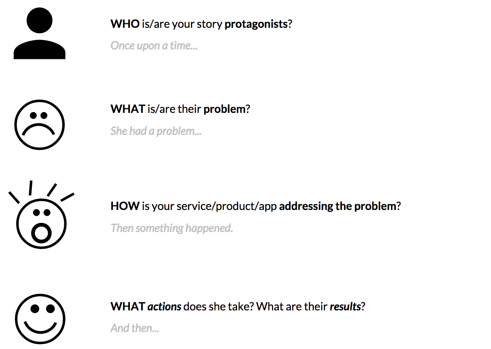
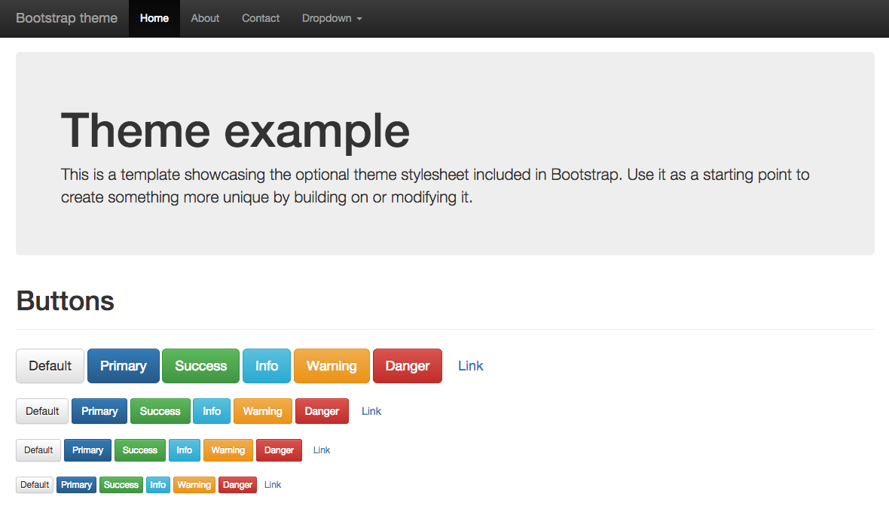
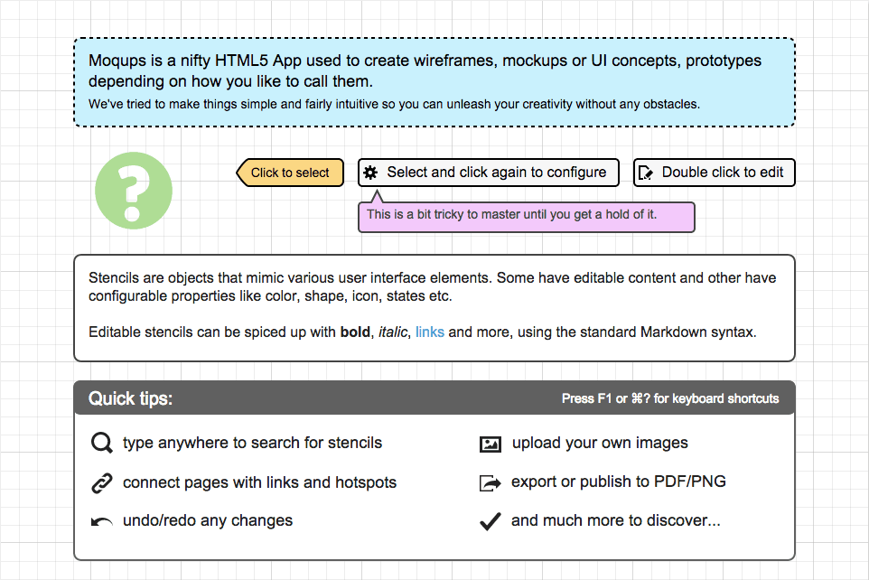

# Apps from scratch, day 4

1. [Questions](#questions) about computers, people and the **interfaces** in between
* [Wireframing](#wireframing) (*user* interfaces)
* [Prototyping with code](#prototyping-with-code) (*programming* interfaces)

# Questions

### How much do you need to know about how a *car* works, in order to *drive* it?

In most cases, you just need to know what pedals to push, what levers to operate, what buttons to press and what knobs to turn.

In other words, you can drive a car just by knowing how to use its **interface**.

<!--Unless you are a mechanic or had an accident -->

### How much do you need to know about how a *computer program* works, in order to *code* it?

You do not always need to know how a script or program works, as long as you know:

1. How to **ask** it do do something
* How to process its **response** 

In other words, you can code a computer program if you know how to use its **interface**.

<!--In our experience as coders, we have learned it's not always necessary to know how everything works, in order to code something.

The questions you can ask and the format of the answers form what coders call an *API*.-->

### Have you heard of APIs before?

[**A**pplication **P**rogramming **I**nterface](https://en.wikipedia.org/wiki/Application_programming_interface).

An API **exposes** parts of a system and **determines** how we (programmers) can interact with them to accomplish our (programming) goals. 

### The parts of a system which are *programmable* have an API 

An API tells us *which* parts of a system are exposed, and *how* we are allowed to tinker with them. 

A **programming language** can be understood as an API, in the sense that it's the tool between us and programming a computer. 

# Wireframing

1. See what's out there
* Wireframe your app idea 
* Review it with class

### Before you design a {XYZ}, you may want to see how others are doing it.

Pick 3 apps that are relevant to your app idea (inspiring interfaces, similar business model etc.) and discuss them with your group.

You can take inspiration from [useronboard.com](http://www.useronboard.com/onboarding-teardowns/).

### Wireframing with the user in mind

Your wireframes shouldn't present *features*. They should tell a *story*.

1. **WHO** 

	* Think about a realistic *protagonist*
	* Give her a name
 	* Make her relatable
2. **WHERE** and **WHEN** 

	Think about a scenario
3. **HOW** 

	What are the *feelings* of your protagonist?
4. **WHAT** 

	* What *actions* does she take? 
	* What are their *results*?

# Prototyping with code

<!--
# Session 4

Key questions: 

* What does your app do? 
* How do you *test* it?

### AM

* [Impact mapping](#impact-mapping)
* [User stories](#user-stories)
* [Your (user) stories](#your-stories)

### PM

* [Wireframing](#wireframes)
* [Rapid prototyping](#rapid-prototyping)

# Impact mapping

As developers, we tend to focus (or get bogged down) on features.

But in order for your idea to succeed, you have to step back and make sure that you think not about the features but about the **impacts** of the software that affects people's behaviour.

Impact mapping is a way of visualising connections between *goals*, relevant people called *actors*, the impacts to their behaviours, and the *features* of the product called *deliverables*.

> Maximum impact by minimum software

[Watch this video](https://www.youtube.com/watch?v=RznIi2WkJb0)

[Impact mapping](http://impactmapping.org/drawing.php)
 is a **strategic planning technique**.

An impact map is a visualisation of scope and underlying assumptions, created **collaboratively**. 

It is a **mind-map** grown during a discussion facilitated by answering the following four questions:

#### Why?

The centre of an impact map answers the most important question: **Why are we doing this?** This is the **goal** we are trying to achieve.

#### Who?

The first branch of an impact map provides answers to the following questions: Who can **produce** the desired effect? Who can **obstruct** it? Who are the **users** of our product? Who will be **impacted** by it? These are the **actors** who can influence the outcome.

#### How?

The second branch level of an impact map sets the actors in the perspective of our business goal. It answers the following questions: **How should our actors' behaviour change?** How can they help us to achieve the goal? How can they obstruct or prevent us from succeeding? These are the impacts that we're trying to create.

#### What?

Once we have the first three questions answered, we can talk about scope. The third branch level of an impact map answers the following question: What can we do, as an organisation or a delivery team, to support the required impacts? These are the **deliverables**, software **features** and organisational **activities**.

### All together now

Go to [GoConqr](https://www.goconqr.com/) and sign up.

In pairs, create an impact map for your product / app idea.
 

# User stories

Have you ever heard of [**BDD** *behaviour-driven development*](http://en.wikipedia.org/wiki/Behavior-driven_development)?

BDD uses the specification of **desired behaviour** as a *ubiquitous language* for all project team members. 

A ubiquitous language is a (semi-)formal language that is shared by all members of a team as a common means of discussing the domain of the project in question.

### What are user stories?

Plain English sentences that **describe the basic units of functionality** of your product.

Useful to:

* state **product requirements** without writing endless pages of documentation
* have a **checklist** for software development 
* not depended on the whims of a stakeholder 
* get *everyone on the same page*

In one sentence, a user story encapsulates

* **Who** is this functionality for?
* **What** does s/he want?
* **When** does s/he want it?  
* **Why** is it valuable to the her?

> Who are we?

> What do we want?

> When do we want it?

> Why?

### The actual format

As a `who?`, I want to `what?`, so that `why?` [`when`]

#### Examples

* As `an administrator`, I want to `search for my customers by their first and last names`, so that `I quickly find specific people to contact`.
* As `a user`, when `closing the application`, I want to `be prompted to save anything that has changed since the last save` so that `I don't lose work`.
* As `a student`, I want to `find my grades online` so that `I don't have to wait until the next day to know whether I passed`.
* As `a book shopper`, I want to `read reviews of a selected book` to `help me decide whether to buy it`.
* As `an author`, I want `the spell checker to ignore words with numbers` so that `only truly misspelled words are indicated`.

### How do you write user stories?

1. Brainstorm and jot down **actors** in the **system**, eg: visitor, potential customer, new customer, customer, system admin, developer, content editor
* For each actor, jot down **actions** s/he may want to do, eg: read about the service, get contact details, find info about opening times.. 
* For each action think about `before I do that, I need to` chains.
* Separate actions between **tasks** (intermediate in a chain) and **goals** (end of chain) 
* Map actions to actors (one action could be assigned to more than one actor)
* Write a user story for each action assigned to a actor, from the actor's perspective.
* **WHO and WHAT are required**, WHY and WHEN are optional
* Organise actions that the system **must / could / shouldn't** allows actors to do

### Your stories

1. Open [**this spreadsheet**](https://docs.google.com/spreadsheets/d/186THtFpf1sIfaWMRGbU6hfNBfKwcJQeFxP255E4wZK4/edit?usp=sharing)
2. Duplicate the `_blank` sheet and give it your name
3. Jot down stories following the [steps above](#how-do-you write-user-stories)

### BDD
 
1. In order to [benefit]
2. As a [Role]
3. I want [feature]

An example with BBC website:

1. As a user of BBC website
2. I want to have a web page for every TV brand of the BBC
3. So that I can get all the information about my favourite Brand

# Wireframes

Is *this* a wireframe?

Is *this* a wireframe?

Is *this* a wireframe?

Just like a map is an abstraction of a place that helps us describe its location and geography, **wireframes are abstractions** of the **structure** of an interactive system and the **relationships** between its components.

* Wireframes are about **communicating your ideas**.

* They are about **content**, **context** and **interaction**. 

	Use **real content**, not *lorem ipsum*. 
	
	**Words** are key. [Interface design is copywriting](https://gettingreal.37signals.com/ch09_Copywriting_is_Interface_Design.php)
	
	Think about **button labels**, how do you label user actions: is it `Share` or `Post` or `Publish` or `Say it!` or `Broadcast` for instance?  

* They're **NOT about style**. 

	When wireframing, don't worry about *colours*, *graphics* and *typography*. 

### Wireframes *with code*

> Standing on the shoulders of giants...

or

> Don't reinvent the wheel

Meet [Bootstrap](http://getbootstrap.com/), a framework to build mobile-first Web-apps and sites. It comes with a set of common *building blocks* to quickly put together interfaces

[Divshot](https://architect.divshot.com/) and [Jetstrap](https://jetstrap.com/) are drag&drop interface builders based on Bootstrap, which you can use to make clickable wireframes.

### Wireframes *sans code* 

Using [Moqups](https://moqups.com/)

# Rapid prototyping

In an *iterative* approach to design, rapid prototyping is the process of **quickly mocking up the future state of a system** and validating it with users, stakeholders, developers and designers. 

Doing this **rapidly and iteratively** ensures that you're moving in the right direction, and lets you quickly **share** that direction.

### What is a prototype?

* Prototypes **answer questions** (the more specific the better). Establish a **clear purpose** for each prototype you make.

* Prototypes stand between your ideas (**assumptions**) and your users (**behaviours**).

* Prototypes should be **quick** (and cheap) to make, re-make and possibly discard.

* Prototypes should be **close** to the real thing. 

### Do

1. **Work collaboratively** with users, teammates and stakeholders while prototyping. Apart from giving valuable feedback, they also gain a sense of **ownership** of the final product.
* When creating interactive high-fidelity prototypes and simulations, build in **realistic delays** (for instance, for screen refreshing or moving through steps of a transaction), so that users do not expect instant response times from the final product.
* Avoid *prototype creep* by **setting expectations** for the process, including ones affecting the purpose, fidelity, scope and duration. Remind everyone, including yourself, that rapid prototyping is a **means to an end**, not an end in itself.
* Begin every prototype review session with the disclaimer that **this is just a prototype**, a mock-up, not the actual solution. This reminds users that this is a **work in progress**, it encourages feedback, and in the case of high-fidelity prototypes, it prevents users from mistaking it for a working solution.

**Reuse, reuse, reuse**. For computer-based prototyping, this means saving reusable templates, stencils, patterns and widgets for future projects.

### Don't

1. **Don't be a perfectionist**. In most cases, rapid prototyping does not have to be 100% perfect, just **good enough** to give everyone a common understanding.
* **Don't prototype everything**. Most of the time, you shouldn't have to. A good rule of thumb is to focus on the **20% of the functionality that will be used 80% of the time**, key functionality that will be used most often. 
* Don't take every change or request that comes out of a prototype review as a new requirement. Rapid prototyping helps capture missed requirements, but these new requirements should be evaluated carefully. Some may be implemented, while others are pushed to a future release.
* Don't begin prototype review sessions without **clear guidelines for feedback**. Be very specific about the type of feedback you are looking for. `Are the steps logically arranged? Is the navigation clear and intuitive?` If not, be prepared for `I don't like the blue in the header` or `Can't we use this font instead?` or `Can you make this bigger, bolder, in red and flashing?`

Don't prototype features or functionality that cannot be implemented. When in doubt, confirm with developers before starting.

### Which tools?

Each prototyping tool has its own feature set and strengths. Based on your needs and the requirements of your project(s), evaluate which tool would be most appropriate:

1. How **easy** is it to learn and use the tool?
* Are there a repositories of **reusable templates** or widgets available?
* How easy is it to make changes on the fly or to **incorporate feedback**?
* Does it have any **collaboration features**, such as allowing multiple people to work on it at the same time?
* What are the licensing terms and **costs**?

##### Tools to consider

* [Sketch](http://www.bohemiancoding.com/sketch/) [Mac only]
* [OmniGraffle](#https://www.omnigroup.com/omnigraffle) [Mac only]
* [Axure](http://www.axure.com) [Mac and Win]
* [Balsamiq](https://balsamiq.com/products/mockups) [Mac and Win]
* [Adobe Muse](http://muse.adobe.com) [Mac and Win]
* [Justinmind](http://www.justinmind.com) [Mac and Win]
* Photoshop and Illustrator [Mac and Win], check out [Web Zap](http://webzap.uiparade.com)
* [Framer](http://framerjs.com)  [Mac only] for slick animations
* [Blocs](http://blocsapp.com) [Mac only] interface builder for Bootstrap
* [Divshot](https://divshot.com/features), online interface builder for Bootstrap

### Your turn

Using [Invision](http://invisionapp.com), let's start prototyping two user flows:

* *onboarding* process (everybody should have that)
* a problematic scenario, aka *edge case* or *unhappy path* (of your choice, depending on gaps you have identified in your user stories)

Produce prototypes that address [your user stories](#your-stories).

-->