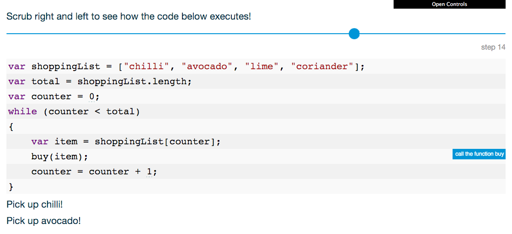

<!--### Plan

AM:
 
- [ ] 0.5 hour

	[Quiz time](https://github.com/RavensbourneWebMedia/Web-development-workshop/tree/2016/sessions/04#quiz-time) with Team A and Team 1

- [ ] 1 hour
	
	Move `script` elements to the end of the `body`
	
	Breakpoint tool
	
	Displaying data (we started last week but it didn't work so let's do that again properly) how to create a string of HTML out of a data object and append it in your HTML

PM:

- [ ] 1 hour

	Filter data
	
	Integrate pre-written functions with an emphasis on what to customise

- [ ] 0.5 hour

	Fun, lightweight activity: CSS / start creating your own database

-->

<!--
http://www.unheap.com

[jQuery challenge by Codecademy](https://www.codecademy.com/learn/jQuery)

Yuki:

- [ ] take [sorting and filtering functions from demo-app](https://github.com/CodeAndCake/AppsFromScratch/blob/v3/demo-app) and create versions of those functions that work with [Firebase API queries](https://www.firebase.com/docs/web/api/query/)
-->


# Coding and app-making for beginners 

## Day 5

[Last week](../04) you tinkered with HTML & CSS and learned how to *upload* new data to Firebase via the JS Console.

Now that our database is ripe with data, we can **filter** that data in response to user **inputs** and display it in the app **interface**.

**Today** we're going to start with a [quiz](#quiz-time) to recap HTML, CSS and JS. 

Then you'll dive into JS, getting hands-on with **jQuery**. We will give you some pre-written code to copy-paste and integrate into your apps.

Today is about mastering **the art of copy-paste**. To become a good coder you don't need to "speak" JavaScript (or whatever other programming language). Instead, you should learn how to:

1. **Search** for solutions online 
* **Skim** through results
* **Copy-paste** relevant results into your code
* **Adapt** the pasted code to your app (changing *variable* names, tweaking *functions* etc).

When writing code, it's important to let go of any fear of making **mistakes**. Embrace mistakes, take them as an opportunity to learn. When something unexpected happens, try to avoid thinking `What have I done wrong?`. Instead ask yourself `Why did the computer not behave as I expected?`. Come up with a possible answer and then test it.

We will show you some tools and tricks to make the process of spotting mistakes and testing solutions (aka **debugging**) very efficient.


# Quiz time!

### HTML

1. The latest version of HTML is `HTML6` 

	- [ ] true 
	- [ ] false
	
	<!-- False. The current and last version of HTML is 5, and since then the numbering system has been dropped so there won't be any HTML6, just like there isn't an English4, English5 etc. HTML is a living, constantly evolving language-->
* EVERY HTML **element** has an **opening tag** (eg: `<a href="http://example.com">`) and a **closing tag** (eg: `</a>`)

	```html
	<a href="http://example.com"> Click me! </a>   
	```
	
	- [ ] true 
	- [ ] false
	
	<!-- Almost true. Some elements like  and <input> don't need a closing tag, because they can't have any other element nested in them-->
* All **attributes** for an HTML elements MUST go both in the opening and closing tags
	
	```html
	<a href="http://example.com"> Click me! </a id="no-spaces-in-between"> 
	```
	
	- [ ] true 
	- [ ] false
	
	<!-- False. Attributes go only in the opening tag-->
*  In an HTML document every `id` **attribute** MUST be unique
	
	```html
    <p id="main-content">...</p>
    <div id="main-content">...</div>
    ```
	
	- [ ] true 
	- [ ] false
	
	<!-- True. -->
* An HTML **element** can have more than one `class`
	
	```html
	<p class="highlight question">...</p>
	```
	
	- [ ] true 
	- [ ] false
	
	<!-- True. -->
* A valid HTML document MUST have a `head` and a `body` elements wrapped in a `html` element
	
	- [ ] true 
	- [ ] false
	
	<!-- True. -->
* What is wrong with this HTML code?
	
	```html
	<p> class="highlight question" ...</p>
	```
	
	<!-- Attributes, such as class="highlight question", must be inside the opening tag, so 
	
	<p class="highlight question"> 
	-->
* What is wrong with this HTML code?
	
	```html
	<script> src="app.js" </script>
	```
	
	<!-- Same as above. Attributes, such as src="app.js", must be inside the opening tag, so 
	
	<script src="app.js"> 
	-->

### CSS

1. Where is best to put CSS? 

	- [ ] `<link rel="stylesheet" href="path/to/your-style.css">`
	- [ ] `<p style="color:red;">This bloody text</p>`
	
	<!-- Better to link to a <link> to a separate CSS document, to keep things tidy. Separation of concerns. -->
* Every CSS file has to end in `.css`
	
	- [ ] true 
	- [ ] false
	
	<!-- True. -->
* What's wrong with this CSS code? 

	```css
   <p> { color: red; }
   ```     
   
   <!-- You don't use angle brackets < and > in CSS, so
   
   p { color: red; } 
   -->
* What's wrong with this CSS code? 

	```css
	p { colour: red; }      
	```
	
	<!-- International English (American) spelling, so
   
   p { color: red; } 
   -->
* What's wrong with this CSS code? 

	```css
    p { color red; }  
    ```
   
   <!-- Missing colon between color and red, so
   
   p { color: red; } -->     
* These two CSS declarations achieve the same effect       
  
  	```css
  	p { color: red; }  
	 
	p 
	{ 
	 	color: red; 
	}
	```	
   	
	- [ ] true 
	- [ ] false 
	
	<!-- True. However we find the second easier to read and recommend using this convention: every CSS rule on a separate line -->    
* The `#` symbol is a shortcut for

	- [ ] `class`
	- [ ] `element`
	- [ ] `id`
	
	<!-- id -->
* A CSS rule must be terminated by 

	- [ ]  `.` period
	- [ ]  `!` exclamation mark
	- [ ]  `;` semi-colon
	- [ ]  `:` colon	
	
	<!-- semi-colon -->
* `style1.css` is loaded and applied before `style2.css`	
	```html
	<head>
    	<link href="style1.css" rel="stylesheet">
    	<link href="style2.css" rel="stylesheet">
	</head> 
	```		
	 	
	- [ ] true 
	- [ ] false 
	
	<!-- True. The browser loads and applies CSS sequentially. So if you have CSS rules that apply to the same element, then the last one will take precedence. -->

### JS

1. *Java* and *JavaScript* are the same thing. 
	 	
	- [ ] true 
	- [ ] false 
	
	<!-- False. They are two different programming languages. Java is the language behind Android (and many other things), JS is the "native" language of the Web.
	Java and JavaScript are like "car" and "carpet".. similar words, different meanings. -->
* What is wrong with this JS code?

	```js
	var userName = 'Jo";
	```
	
	<!-- Quotation marks must match. You either use double or single quotes. So, 
	
	var userName = "Jo";
	
	or 
	
	var userName = 'Jo';
	-->
* What is wrong with this JS code?

	```js
	var person = { };
	person name = 'Jo';
	```
	
	<!-- Properties inside objects must be accessed via . (dot notation) so
	
	person.name = 'Jo';
 	-->	
* What will this JS code produce?

	```js
	person.drink = function ( beverage ) { 
		alert ( "I am drinking " + beverage + "!" ); 
	}
	
	person.drink( "coconut water" );
	```
	
	<!-- An annoying pop-up saying "I am drinking coconut water!" -->
* What will this JS code produce?

	```js
	person.whisper = function ( message ) { 
		console.log ( person.name + " says: " + message ); 
	}
	
	person.whisper( "Keep calm and code on" );
	```
	
	<!-- A message in the browser's JS Console (one of the most useful developer tools) saying: "Jo says: Keep calm and code on" -->
* What will this JS code produce?

	```js
	function areYouAnAdult ( age ) {
   	var answer;
    	if (age < 18) {
     		answer = "no";
    	} else {
     		answer = "yes";
    	} 
    	return answer;
	}
	
	areYouAnAdult( 18 );
	```
	
	<!-- It will return "yes" -->
* Where is better to put JavaScript `<script src="example.js"></script>` in your HTML?

	- [ ] inside the `head`
	
		```html
		...
		<head>
			...
			<script src="example.js"></script>
		</head>
		<body>
			...	
		```
		
	- [ ] at the end of the `body`
	
		```html
		...
		<body>
			...	
			<script src="example.js"></script>
		</body>	
		```
	
	<!-- Both are fine, however end of body is recommended, because your JS may need the body (with all its content) to be loaded first, and then it can execute properly -->	

<!-- 

Inspirations  for the JS quiz
https://www.khanacademy.org/computing/computer-programming/html-css-js/html-css-js-intro/e/quiz--javascript-recap 
http://tonyfreed.com/blog/top_javascript_interview_question_2015
-->

# TODO

- [ ] wrap everything in `<section id="home"> </section>`
- [ ] create another section for `details`

	```html
	<section id="detail">

     <a id="back">Back</a>

     <div id="person">
       
       <h2>
         Yuki
       </h2>
       <p>
         I like coding and coffee
       </p>
       <a class="contactButton">Contact Yuki</a>
     </div>
   </section>
   ```

- [ ] take JS out of `head` and paste it into `body`
- [ ] add `value` attributes to `option` elements


<!-- LUNCH! -->


#  A couple of programming essentials

### Functions
	
Functions are sets of instructions, packaged nicely for us to use over an over. 

Functions make code **reusable**. 

Remember, you use functions of sorts everyday to do simple tasks. For instance, to make tea!

A function for making tea might look like this (not actual JS, just the logical steps)

```js
function makeTea ( whichTea, howMuchSugar, howMuchMilk ) {   
	1. check for teabags of whichTea type   
	2. fill the kettle   
	3. boil the water   
	4. get a clean cup   
	5. put teabag in the cup 
	6. if howMuchSugar is more than zero, and we have sugar, then add sugar to the cup
	7. if howMuchMilk is more than zero, and we have milk, then add milk to the cup  
	8. return the tea! 
}
```
 
It would be exhausting for us to have to say out loud all of those individual steps every time we wanted to ask someone for a cup of tea!
<!--
Likewise, if we want to search through lots of variables to see if there's a `pear` inside, then we can use a function to carry out the repetitive task of going through many pieces of data.

We can *declare* a function like this to do that job

```javascript
function checkForPears (objectToCheck) {
	if (objectToCheck == "pear") {
		console.log("There's a pear in here!")
	} else {
		console.log("No pears in here, better luck next time!")
	};
}
```

We have packaged our instructions into a function, which means we don't have to type out all that code every time we want to search through variables. 

All we need to type is this:

```javascript
var myFavouriteFruit = "orange";
checkForPears(myFavouriteFruit);
```

Because we have no `pear` in `myFavouriteFruit`, the Console will log `No pears in here, better luck next time!`.
-->

So, to use a function you must

1. *declare* it: give it a **name** and teach the computer all the **steps** required to perform it

	```javascript
	function areYouAnAdult (age) {
		var answer;
		if (age < 18) {
		 	answer = "no";
		} else {
		 	answer = "yes";
		} 
		return answer;
	};
	```
2. *call* it: tell the computer to **execute** the code inside the function, by writing its name followed by *round brackets* `()`	

	```javascript
	areYouAnAdult(16);
	```
	
In between *round brackets* `()` we can pass one or more *variables* to the function.
	
```javascript
areYouAnAdult(18);
areYouAnAdult(23);
areYouAnAdult(21);
```
	
The variables we *pass* to a function in between *round brackets* `()` will be used inside the function as the temporary value for `age`.

Variables inside a function are very useful, because they make the function **reusable**.

<!--
### Arguments

`checkForPears` is a **reusable** function. What makes it **flexible**?

It's `fruit`, a [variable](#variables) which lives inside the `checkForPears` function.

`I'm hungry` and `I need a nap` are called **arguments** ([don't argue, that's what they're called](http://programmers.stackexchange.com/questions/186293/why-are-actual-parameters-called-arguments)) and they are the actual values that we *pass* to a function.
-->

#### What happens in a function, stays in a function

There's another powerful thing we can do with functions: we can use them to take in some values, *compute* them, and then *return* a new value.

```js
function areYouAnAdult (age) {
	var answer;
	if (age < 18) {
	 	answer = "no";
	} else {
	 	answer = "yes";
	} 
	return answer;
};
```

`return` does two things: 

1. it gives a value back
2. it immediately exits the function

```js
areYouAnAdult(16); // returns "no"
areYouAnAdult(23); // returns "yes"
```

Without `return` we wouldn't know the answer!

### Arrays

[Two weeks ago](../sessions/03) we created an empty list `peopleList[]` in our `app.js` file, as an empty "box" for us to store the data of each person.

In JavaScript, these lists are called **arrays**. You store data in arrays much like a numbered shopping list.  

For example, you can create an array like this:

```javascript
var shoppingList = ['chilli', 'avocado', 'lime'];
``` 

You can check what's in each position. Instead of starting with number 1, arrays always **start with 0**.

`chilli` is at position 0, `avocado` is position 1 and `lime` is at position 2.

 Written like this: 

`shoppingList[0]` the value at position 0 in `shoppingList` is `chilli`. 

`shoppingList[1]` the value at position 1 is `avocado`.

`shoppingList[2]` the value at position 2 is `lime`.

<!--   ARRAY GRAPHIC   -->


Arrays have some handy features such as the `length` property, which returns the length of the list.

You can check how many things are in your array like this:

```javascript
console.log(shoppingList.length);
```

### Loops

Have you ever played an album *on loop*? The first song plays, then the next, then the next until you reach the last song and it starts all over again.

If you think of this like code:

* The **instruction** or **function** is **play**

* The **array** being looped through is the **album**

* The **data** used are the songs

Loops are essential for our apps to work!

In your app, you will sift through, filter and sort out every set of data in your database. You'll **loop through** the entire database and use *functions* (or sets of instructions and actions) to do things with that data. 

This saves you rewriting your functions for every single person, place, or artist in your database.

Click on the image below to open an interactive explanation of a loop, which you can find at `s.codepen.io/baddeo/debug/NGjJjd`

[](http://s.codepen.io/baddeo/debug/NGjJjd)

#### jQuery

jQuery is a useful library of prewritten *functions* (sets of isntructions and actions).

Many common functions are nicely packaged in jQuery to save us time!

For your app, you'll need to know a couple of things:

* You can use jQuery to **select** parts of your HTML
* You can use jQuery to perform `functions` on those selected parts

Using jQuery in your code can look like this:


In order to use jQuery we must load it in our HTML document. Remember how you loaded Firebase? Using `<script src=" ... "></script>` tags we need to load jQuery in the same way.

At the end of the document `body` add a `script` like this

```html
		...
		<script src="https://code.jquery.com/jquery-2.2.1.js"></script>
	</body>
</html>	
``` 


# Back to your app

### What have you done so far?

* In your `index.html` file, you structured your app's interface

* You styled that interface using CSS. You targeted specific HTML elements using `class` and `id`

	HTML | CSS
	---- | ---
	`class` | `.`
	```html <p class="question"> ... </p>``` | ```css .question { ... } ```
	`id` | `#`
	```html <p id="firstQuestion"> ... </p>``` | ```css #firstQuestion { ... } ```
	
* In `app.js` you created a new Firebase database

	```javascript
	var database = new Firebase('https://appsfromscratch.firebaseio.com/demo-app')
	```

* Then an empty `array` (or list)

	```javascript
	var peopleList = [] // an empty list, for now 
	```

* Loaded each `person`'s data within the database into the array `peopleList[]` 

	```javascript
	// load data
	database.on('child_added', function(person) 
	{
  		var personData = person.val() // this is Firebase val()
  		peopleList.push(personData) // "push" is JavaScript's lingo for "add to a list"
	})
	// see the docs https://www.firebase.com/docs/web/guide/retrieving-data.html#section-event-types
	```

	Remember, that last step uses some Firebase functions: 

	* `on()` is the Firebase listener that says ***when** something happens (an **event** like a click) then perform an action* 

	* `val()`is a Firebase function that collects the data you've stored inside each `person`. In our case, the data was `likesPets`, `bakingSkills`, `bodyStrength` and so on...

	It also uses a *native* JavaScript function:

	* `push()` adds whatever is passed through the brackets () into an `array`.

	Didn't we use `push()` to save data into our database? 

	Yes! We checked the Firebase docs [firebase.com/docs/web](https://www.firebase.com/docs/web/guide) to see which functions they want us to use to save data using their service. It just so happens they also use `push()`. You used that Firebase function to save data into the database: `database.push(person)`

## Let's move on!

<!--### 1. Create an `html` object

First, prepare a JavaScript object which selects all the HTML elements. This will make it easier to display data in your HTML. 

Go to **LINK HERE** and copy the following code:

```javaScript
// First let's store all the interface elements we need from HTML in an object
// We are using jQuery ($) to select stuff from HTML
var html = {
  pageWrapper: $('article'),
  pageSearch: $('#pageSearch'),
  searchInput: $('#pageSearch input[type=search]'),
  findButton: $('#pageSearch button'),
  dropDown: $('#pageSearch select'),
  results: $('#pageSearch .results'),
  totalFound: $('#pageSearch .results .total'),
  resultsList: $('#pageSearch .results ul'),
  pageProfile: $('#pageProfile'),
  backButton: $('#pageProfile .back'),
  person: $('#pageProfile .person')
};
```
Paste it into app.js under the `peopleList[]` array.

In this object which we've named `html`, jQuery is used `$` to select HTML elements from your interface by `class` and `id`.-->

<!--  HTML OBJECT GRAPHIC  -->

Open your Thimble project.

### 1. Load jQuery

Open `index.html`.

Just before the **end** of the `body` add a `script` like this

```html
		...
		<script src="https://code.jquery.com/jquery-2.2.1.js"></script>
	</body>
</html>	
``` 

Once jQuery is included, we can check if it's ready to for us to use.

Open the Console <kbd>cmd</kbd> + <kbd>alt</kbd> + <kbd>J</kbd> and then type in `jQuery` and press Enter.

If the Console doesn't spit out a red error, you're good to go!

### 2. Hide the `#details` section by default

When people open the app, we don't need them to see details about a person. Later we will write some JS code to display that `section` **when** people click on a result, but for now we want to **hide** that part of the HTML.

In `app.js` write

```js
$('#details').hide();
```  

The line above does two things:

1. `$('#details')`: **select** the element with `id=details`
* Perform the `hide()` function on that selection

### 3. When someone clicks on the `Find` button, what happens?

Go to the [Copy-paste GDoc bit.ly/copyPasteCodeYourApp](https://bit.ly/copyPasteCodeYourApp) and copy the following code (you can find it under Day 5):

```javascript
$('button').on('click', function() {
    
  // get user input
  var selectedOption = $('select').val(); // this is jQuery val()
 
  // filter people by user selection
  var resultsList = filterAndSortList(peopleList, selectedOption);
  
  console.log(resultsList);

  // and show the results
  // showList(resultsList)
})
```

#### Let's break it down

First the outer shell:
```javascript
$('button').on('click', function(){
..............
..............
})
``` 

`$('button')` selects the `Find` button.

`.on('click', function() { ........... })` says **when** the user **clicks** the selected element, perform this function. In our case, **when** the user **clicks** `Find`, perform this function.

*Inside* the function:

```javascript
// get user input
var selectedOption = $('select').val(); // this is jQuery val()
```

1. Select the `select` (HTML for dropdown) with jQuery `$`
* Get the currently selected value (for example the `likesPets`) using the jQuery function `.val()`
* Save that value in a `var` named `selectedOption`

```javascript
// filter people by user selection
var resultsList = filterAndSortList(peopleList, selectedOption);
```

1. Use the function `filterAndSortList` to filter and the list with all the people `peopleList` to match the user's selection
* Store the filtered people in a `var` named `resultsList`

You can find the function `filterAndSortList` at [github.com/CodeAndCake/AppsFromScratch/blob/v3/demo-app/js/functions/filter.js](https://github.com/CodeAndCake/AppsFromScratch/blob/v3/demo-app/js/functions/filter.js) (link also in the copy-paste doc).

Create a new file in your Thimble project, call it `filter.js` (or whatever you like) and then at the end of `body` in `index.html` use a `script` to load `filter.js` in your app.

<!--
**filter** the data to match the user's selection (leaving out results that don't match the user selection)

2. For example, if the selected option is `Keep my pet`, we will filter out all the people that don't like pets (ie `person.likePets = false`)
* **sort** the filtered data into order - small to big, or big to small. 

the highest criteria match comes first (think Google search - most relevant results come up higher in the search results)
	For example, if the selected option is `Move my piano`, we will sort the people based on their body strength (ie `person.bodyStrength = 5`)
	-->


# TODO

* **display** the filtered and sorted data

There's something missing, right?


### 2. Filter, sort and display

Yes! Each of those 3 lines of code contains a function which we must declare, otherwise nothing will happen when the user clicks on the `findButton`.

You'll need to create some new JavaScript files 

Right-click under your files in the left sidebar of your Thimble project. Create a `New Folder` and call it `js`. Now right-click on the javaScript folder and create a `New Folder` inside it called `functions`. Right-click on app.js and `Move To` the `js` file.

Inside the functions folder, create 3 `New File`s:
* filter.js - go to this link **LINK HERE**, copy all the code and paste into your filter.js file
* sort.js - go to this link **LINK HERE**, copy all the code and paste into your sort.js file
* show.js - go to this link **LINK HERE**, copy all the code and paste into your show.js file<!-- NEED TO CHECK IF IS OK - showList and showProfile in one file -->


## Your turn!


<!--
1. [Inspirations](#inspirations): cool stuff built with JS
* [JS challenge](#challenge)
* [Prototype](#prototyping) one component of your app


# Inspirations

Some cool stuff built with JS (100% Web technologies)!

[Emotion detection  
	](http://auduno.github.io/clmtrackr/examples/clm_emotiondetection.html)

[Audio (from mic) visualiser
](http://googlechrome.github.io/web-audio-samples/samples/audio/visualizer-live.html)

[3D London Tube map    
	](http://brunoimbrizi.com/experiments/#/07)

[Cyber-attacks map  
	](http://map.norsecorp.com/)

[Social media activity map  
	](http://wearedata.watchdogs.com/start.php?locale=en-EN&city=london)


# Challenge!

1. [Fork this pen](http://codepen.io/baddeo/full/JYpgwL)!
* Add an `option` to the dropdown. 
 
	You may have to add new data to the *spreadsheet* (aka the database).   
* Code the app's behaviour in response to the new option.

	There are 3 functions you will need to hack:
	
	* `getPeopleList`
	* `getFilteredList`
	* `getSortedList`


# Prototyping

-->


<!--- [ ] Aimee can help with HTML and CSS-->


<!--

1. [Questions](#questions) about computers, people and the **interfaces** in between
* [Wireframing](#wireframing) (*user* interfaces)
* [Prototyping with code](#prototyping-with-code) (*programming* interfaces)


# Session 5

Key questions: 

* What is your app *value*? 
* How do you *communicate* it?


### AM

* [Designing behaviours](#designing-behaviours)
* [Telling the user story](#telling-the-user-story)
* [Wireframing](#wireframing) and [prototyping](#prototyping)

### PM

* [Presentations](#presentations)


# Designing behaviours

Not just interfaces.

We deal with interfaces, tools and devices, but what we design, ultimately, are **human behaviours**. 

We design means to **enforce**, **prevent** or **facilitate** behaviours.

### Persuasive interfaces

[](http://goodui.org/#9 "Telling who it's for instead of targeting everyone")

[](http://goodui.org/#4 "Social proof > testimonials")

[](http://goodui.org/#18 "Benefit Buttons instead of just task based ones")

[](http://goodui.org/#7 "Recommending instead of showing equal choices")

[](http://goodui.org/#30 "Loss Aversion instead of emphasizing gains")

[](http://goodui.org/#35 "Urgency instead of timelessness")

[](http://goodui.org/#36 "Scarcity instead of abundance")

[](http://goodui.org/#41 "Anchoring instead of starting with the price")

[](http://goodui.org/#44 "Smaller Commitments instead of one big one")


### Engaging interfaces

[](http://goodui.org/#48 "Natural Language instead of dry text")

[](http://goodui.org/#13 "Just enough input > gradual engagement")

[](http://goodui.org/#37 "Recognition instead of recall")

[](http://goodui.org/#14 "Exposing Options instead of hiding them")

[](http://goodui.org/#33 "Inline Validation instead of out-of-context errors")

[](http://goodui.org/#25 "Designing For Zero Data instead of just data heavy cases.")

[](http://goodui.org/#53 "Useful Calculations instead of asking to do math")

[](http://goodui.org/#8 "Undos instead of prompting for confirmation")

[](http://goodui.org/#52 "Thanking instead of simply confirming completion")

[](http://goodui.org/#58 "Set Collections instead of independent items")

[](http://goodui.org/#23 "Fewer Borders instead of wasting attention")

[](http://goodui.org/#47 "Icon Labels instead of opening for interpretation")

Also, check out animated examples of design patterns at [UseYourInterface](http://useyourinterface.com)


# Telling the user story

Don't present *features*. Tell a *story*.

1. **WHO** 

	* Think about a realistic *protagonist*
	* Give her a name
 	* Make her relatable
2. **WHERE** and **WHEN** 

	Think about a scenario
3. **HOW** 

	What are the *feelings* of your protagonist?
4. **WHAT** 

	* What *actions* does she take? 
	* What are their *results*?


# Wireframing

See last session's [notes on wireframing](../04/README.md#wireframes)

Think about the **3-4 key pages** that communicate what's unique about your app and how it benefits who uses it

Use [Moqups](https://moqups.com) or [Divshot](https://architect.divshot.com) to create your wireframes

# Prototyping

We'll show you hot to use [Invision](http://invisionapp.com), to link your wireframes and set them in motion.

Your prototypes will communicate how your app works, and offer a springboard for conversations with developers, designers, collaborators, investors...

-->


### License

[](http://creativecommons.org/licenses/by-nc-sa/4.0)

This work is licensed under a [Creative Commons Attribution-NonCommercial-ShareAlike 4.0 International License ](http://creativecommons.org/licenses/by-nc-sa/4.0)

