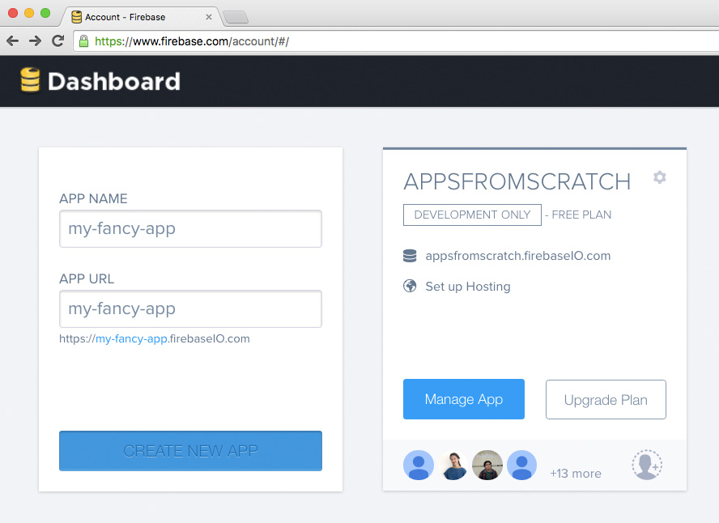

<!--

#### Creating HTML on demand

One of the most common tasks you use JS for, is to **grab data** (from a database, from user inputs, from elsewhere on the Web...) and **inject it** somewhere in the HTML. 

For example, an app like GMail uses JS to grab data from a mail server and inject it in the HTML page that displays your inbox. Facebook grabs data from your "friends" and injects it in your timeline.

The *end-user* rarely sees *raw* data. Rather, they see data *wrapped* inside HTML.

#### How to wrap data

Imagine you want to greet users by name when they log in to your app.

The HTML for that could be something like

```html
<p id="greeting">Good morning John!</p>
```

If you had only 1 user and we knew their name, then you could *hard-code* that name in your HTML. But in the more likely case that you have many users, you don't want to have a special page for each one of them!

Instead, you can store the user name in a *variable*, and use JS to *inject* the variable in that greeting paragraph.

```js
var userName = user.get('name'); // imagine the user data comes from a database
var greetingParagraph = $('#greeting');
var greetingText = 'Good morning ' + userName + '!';
greetingParagraph.text( greetingText );
```

Notice how we split the greeting text into 3 parts:

1. `'Good morning '` is a non-variable bit
*  `userName` is the *variable* part
*  `'!'` is another non-variable bit at the end of the sentence

To string these parts together into one sentence, we use `+` (this is technically called *string concatenation*):

```js
var greetingText = 'Good morning ' + userName + '!';
```

#### How to inject data

To **change** the content of an HTML element selected with jQuery, you can use the `.text( )` function like we did above:

```js
greetingParagraph.text( greetingText );
```

What if you want to **add** something to an existing HTML element, without changing what's already there?

In that case, you can use the `.append( )` jQuery function (which will add whatever you pass into the function *at the end* of the selected element) or the `.prepend( )` jQuery function (which will add whatever you pass into the function *at the beginning* of the selected element).

For example, if you want to add a note about the weather to your greeting text, you could do it like this

```js
...
var weather = 'sunny'; // imagine we got this data from a weather service like BBC Weather
var weatherText = ' Today is going to be ' + weather;
greetingParagraph.append( weatherText );
```
-->

<!--
### Your turn

In our demo app, we grab data from Firebase. 

Your next **challenge** is to wrap that data inside `li` elements and then inject it in the `ul`.

1. To use jQuery you need to load it into your HTML. Go to [jquery.com/download](http://jquery.com/download) and download **jQuery 2.x**. 
* Check the `head` of your `index.html` to see how you can include the jQuery file in there. Hint: there are already two `.js` files in the `head`.
* Using jQuery, select the `ul` (unordered list) and store it in a *variable*.
* In the morning, you added some *placeholder* `li` (list item) elements inside the `ul`. Looking at each list item, which parts are *variable* and which are fixed? With that in mind, use JS to create list items with data from `database` in them.
* *Append* the list items to `ul`.

-->


<!--### Plan

AM:
 
- [ ] 0.5 hour

	[Quiz time](https://github.com/RavensbourneWebMedia/Web-development-workshop/tree/2016/sessions/04#quiz-time) with Team A and Team 1

- [ ] 1 hour
	
	Move `script` elements to the end of the `body`
	
	Breakpoint tool
	
	Displaying data (we started last week but it didn't work so let's do that again properly) how to create a string of HTML out of a data object and append it in your HTML

PM:

- [ ] 1 hour

	Filter data
	
	Integrate pre-written functions with an emphasis on what to customise

- [ ] 0.5 hour

	Fun, lightweight activity: CSS / start creating your own database

-->

<!--
http://www.unheap.com

[jQuery challenge by Codecademy](https://www.codecademy.com/learn/jQuery)

Yuki:

- [ ] take [sorting and filtering functions from demo-app](https://github.com/CodeAndCake/AppsFromScratch/blob/v3/demo-app) and create versions of those functions that work with [Firebase API queries](https://www.firebase.com/docs/web/api/query/)
-->


# Coding and app-making for beginners 

## Day 5

[Last week](../04) you:

* learned how to give your HTML elements a `class` or `id` 
* you then got really specific with your styling (not all paragraphs need to look exactly the same!) 
* learned about code libraries like jQuery 
* used jQuery to select a whole section of your HTML and hide it by default
* got hands-on experience being a real coder, copying and pasting chunks of code into your projects


<!--
Now that our database is ripe with data, we can **filter** that data in response to user **inputs** and display it in the app **interface**.--> 

So far you've successfully created an app template for yourself which you'll use as a base for your own ideas.

**Today** we're going to start personalising your apps, you will:

* jot down some ideas for apps 
* create your own new Firebase
* design and structure your data
* hack the Firebase pusher and push data to your new database
* and start adapting the functions to display exactly what you want

That sounds like a lot!

We'll take it slowly :)
<!--
### The *art* of `copy-paste`

Today is about mastering **the art of copy-paste**. To become a good coder you don't need to "speak" JavaScript (or whatever other programming language). Instead, you should learn how to:

1. **Search** for solutions online 
* **Skim** through results
* **Copy-paste** relevant results into your code
* **Adapt** the pasted code to your app (changing *variable* names, tweaking *functions* etc).

When writing code, it's important to let go of any fear of making **mistakes**. Embrace mistakes, take them as an opportunity to learn. When something unexpected happens, try to avoid thinking `What have I done wrong?`. Instead ask yourself `Why did the computer not behave as I expected?`. Come up with a possible answer and then test it.

We will show you some tools and tricks to make the process of spotting mistakes and testing solutions (aka **debugging**) very efficient.
-->

# Your app


Have a think about how you can hack the template we've made together.

Remember the components:

* Interface: dropdown search menu and find button
* Data: we used people and ranked their skills, what could you replace people with?
* Logic: only the people who ranked highly in the searched-for skill are shown in the results

What app ideas could you bring to life using this same structure?


# Build your own database

Good apps need good data.

This doesn't mean a lot of data, but rather **well structured** data.

A good database doesn't look like a *bucket* full of unstructured data. Instead, a good database is organised so that it's easy (and quick) to search through heaps of objects and pick just the ones you want.

Let's look at three general principles of database design, and then you'll apply those to your own database.


## Key database design principles

### 1. Break your data into *logical pieces*

<!--Also known as [1NF](http://en.wikipedia.org/wiki/First_normal_form) (first normal form).--> 
    
#### Bad example
     
| Person | 
| ------ |
| Danny Base 21 |

#### Better example

| Name | Surname | Age | 
| ---- | ------- | --- |
| Danny | Base | 21 |

This way you can take specific bits of data and spit them out wherever and however you want in your app.

Also, you could do things like `calculate the average age of our people`.

<!--### 2. Break it into multiple *dimensions*

Using arrays.

#### Bad example

| Recipe name | Ingredients | Method |
| ----------- | ----------- | ------ |
| Banana bread | 1 banana <br>1 cup of flour <br>pinch of salt | 1. Mix dry ingredients <br>2. Mash the banana <br>3. Mix it all together <br>4. Bake it for 30 minutes | 
| Avocado on toast | 1 avocado <br>2 slices of bread <br>squeeze of lemon | 1. Toast bread <br>2. Scoop out avocado <br>3. Spread avocado on toast <br>4. Squeeze lemon on top | 

#### Better example

<table>
    <tr>
        <th>Recipe name</th>
        <th>Ingredients</th>
        <th>Method</th>
    </tr>
    <tr>
        <td>Banana bread</td>
        <td>
            <table>
                <tr>
                    <th>Quantity</th>
                    <th>Unit</th>
                    <th>Name</th>
                </tr>
                <tr>
                    <td>1</td>
                    <td></td>
                    <td>banana</td>
                </tr>
                <tr>
                    <td>1</td>
                    <td>cup</td>
                    <td>flour</td>
                </tr>
                <tr>
                    <td>1</td>
                    <td>pinch</td>
                    <td>salt</td>
                </tr>
            </table>    
        </td>
        <td>
            <table>
                <tr>
                    <th>Order</th>
                    <th>Description</th>
                </tr>
                <tr>
                    <td>1</td>
                    <td>Mix dry ingredients</td>
                </tr>
                <tr>
                    <td>2</td>
                    <td>Mash the banana</td>
                </tr>
                <tr>
                    <td>3</td>
                    <td>Mix it all together</td>
                </tr>
                <tr>
                    <td>4</td>
                    <td>Bake it for 30 minutes</td>
                </tr>
            </table>    
        </td>
    </tr>
</table>-->

### 2. Use numbers for *ranking*

Computers are extremely good at maths. For a computer,  computing numbers is a piece of cake. Yet computing natural languages (such as English) is something that even the most sophisticated machines still struggle with (think of Siri, for example).

What's the trick then, if you want your app to be able to tell you `who are the best bakers in my area` for example? You **rank** people according to their baking skills.

#### Bad example
     
| Name | Surname | Baking skills | 
| ---- | ------- | ------------- |
| Danny | Base | Excellent |
| Jordan | Scripts | Amazing |

#### Better example

| Name | Surname | Baking skills (0-5) | 
| ---- | ------- | ------------- |
| Danny | Base | 4 |
| Jordan | Scripts | 3 |

If you want to rank data objects by **relevance** to a certain concept / keyword, use numbers.

| Name | Surname | Comedy | Sci-fi | Western
| ---- | ------- | ------ | ------ | -------
| Quentin | Tarantino | 2 | 0 | 3
| Martin | Scorsese | 3 | 0 | 1
| Stanley | Kubrick | 0 | 3 | 0
| Sofia | Coppola | 3 | 0 | 0


## Your turn!

Starting from you app idea, consider:

* What is the **data unit**? 
	
	For example, in our demo app the *data unit* is a person and in the database we're storing people's profiles. 
	
	If you're making a cooking app, the *data unit* would be a recipe.  

* What pieces of data will your *data unit* feature? 

	For example, in our demo app for each person we're storing `name`, `blurb`, `profile picture`, `likesPets`, `bakingSkills` etc. 
	
* Which data pieces will be used to **rank, filter & sort**? 
	
	For example `likesPets` helps us filter data for the *I'd like someone to keep my pet* option, `bakingSkills` helps us filter data for the *I'd like someone to bake a cake* option, etc.

**Make a list** of all the data pieces for your data unit on paper.

Go to Firebase, log in and *create a new app* (which really means create a *new database*).

1. Hover over the greyed-out box in the top-left corner

	
* Give your *app* a unique name	

	
* Click on `CREATE NEW APP`	

	
* Once your new app is ready (it will take a few seconds) it will appear next to the greyed-out box, click on its URL to open it

	
	
### Push data to your new Firebase

Go to [bit.ly/firebasePusher](http://bit.ly/firebasePusher) and click `Remix`.

This is a Thimble project which uses an HTML `form` to *push* data to Firebase. In order to make it work with your own Firebase database, you need to make a couple of changes:

1. Change `databaseURL` to your own Firebase URL

	
* Tweak the `input` elements so that they reflect your data structures. Make sure you change the `name` *attributes*, eg:

	```html
	<input name="CHANGE_THIS" ...>
	```

	Add as many `input` elements as you need. You'll find some examples of common input types in the Thimble HTML code.


# Displaying data

Once you've created your own database and *pushed* data to it, you'll need to customise the code you already have to display your new data.

### Remix your project

So you don't lose your previous work:

1. Publish your project publish
* Preview it 
* Press the `Remix` button. This will make a copy of the project. Now you can tweak this code to fit your new data (without losing your first project).

### Customise your code

1. In your remixed project, open `app.js` and change `databaseURL` to your own database URL. 

	> This will instruct the app to load data from your own Firebase.
* In `index.html` change the `option` elements to reflect your data. 

	Make sure the `value` attributes match the property names you are using in Firebase. 
	
	> For example, the `bakingSkills` in the HTML dropdown below **must** match the `bakingSkills` property stored in Firebase, letter by letter, and it's case sensitive.
	
	> ```html
	<select>
		<option value="bakingSkills">Bake a cake</option>
		...
	</select>
	```
	
	> 
	
<!--
Take a look at the code, can you spot the parts you need to change?

Your data might not include people... what if you're storing places or items?

Sift through the code and change `person` to whatever your objects are.

Remember to also change `personId` , `personHTML` and `makePersonHTML`!
-->


### Change the display

Go to the function `show.js`.

Scroll down to around line 43. 

`makeListItemHTML` is the function which populates the results list:

```js
function makeListItemHTML (person, index) {
	/*
 		This function creates some nice HTML around the person's data

 		Return something like this:

 		<li>
   		<h2>Aimee</h2>
 		</li>
	*/

	// li = List Item
	var li  = '<li id="' + index + '">' 
	+ '<h2>' + person.name + '</h2>' 
	+ '</li>'        

	return li        
}
```

> This function takes in the JavaScript object `person` and spits out an HTML list item `<li>...</li>`

> As you can see, in `li` there are some **invariable bits** like `<li id="`, and some **variable bits** like `person.name` 

If you want to add an `img` for instance, then you can tweak the lines where `li` is stringed together: 

```js
var li  = '<li id="' + index + '">' 
+ '' 
+ '<h2>' + person.name + '</h2>' 
+ '</li>'    
```  		
	
### Finishing touches

Copy and paste this code into the `head` of your HTML document under the `title` element. You can find it in the copy-paste document:

```html
<meta name="viewport" content="width=device-width, initial-scale=1.0, maximum-scale=1.0, minimum-scale=1.0, user-scalable=no">
<!-- Enable fullscreen Mode -->
<meta name="apple-mobile-web-app-capable" content="yes">
<meta name="mobile-web-app-capable" content="yes">
<!-- Icon for home screen -->
<link rel="apple-touch-icon" href="CHANGE THIS SO THAT IT POINTS TO AN IMAGE URL">
<link rel="icon" sizes="296x296" href="CHANGE THIS SO THAT IT POINTS TO AN IMAGE URL">
``` 

This code ensures your app will display well on mobile. Be sure to change the `link` `href="  "` to the url of whatever image you'd like to use for your app icon. The image should be square shaped for the best display.


### License

[](http://creativecommons.org/licenses/by-nc-sa/4.0)

This work is licensed under a [Creative Commons Attribution-NonCommercial-ShareAlike 4.0 International License ](http://creativecommons.org/licenses/by-nc-sa/4.0)