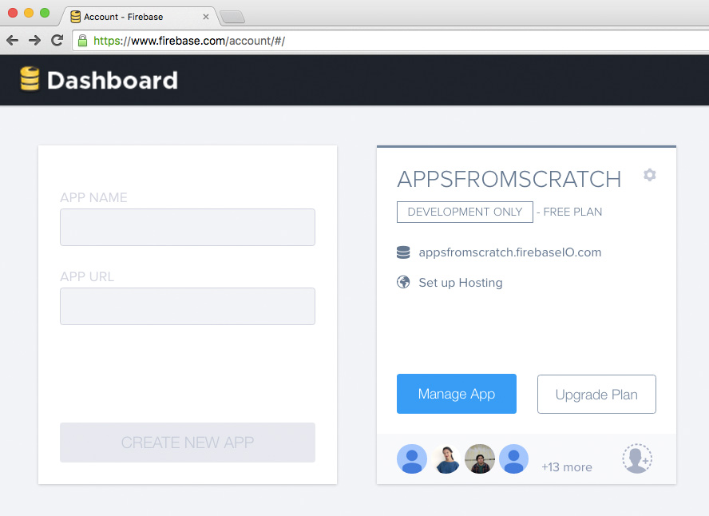
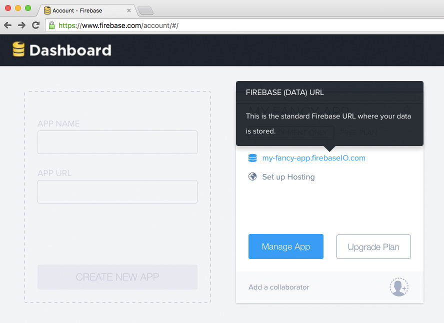
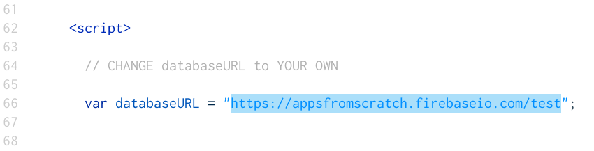
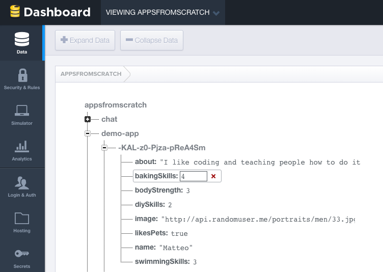

<!--### Plan

- [ ] **Build your own database**

	10-15 minutes A few pointers on how to do it. How do you want to filter that data? What is the UX? 
	
	Talk about ranking and "data design" (see https://github.com/RavensbourneWebMedia/Web-development-workshop/blob/2015/sessions/week-15.md#data-design-principles)

- [ ] Matteo to build a Thimble hackable Firebase form, based on this https://github.com/macek/jquery-serialize-object and http://jsfiddle.net/sxGtM/3/

	So students can customise it to their own data, change the Firebase URL and then start submitting objects

- [ ] **Remix** the demo-app & code your own app

	Add this code to make it look like a proper app on your phone
	
	`viewport` and icons

	Add it to your home screen!
	
- [ ] Evaluation form (15 minutes)

- [ ] Possibly volunteering people for focus group 	
- [ ] [Resources](#resources) to continue your app-making journey

- [ ] [Celebrate](#celebrations)! :cake:

- [ ] What else have they achieved? Go through the 5 days again	 -->


# Coding and app-making for beginners 

## Day 6

[Last week](../05) you experienced hands-on what it's like to be a coder:

* Integrating **code libraries**, like jQuery and Firebase JS, and reading their **docs** to learn how to use them 
* **Copy-pasting** existing code into your project
* **Adapting** pasted code to your app (changing *variable* names, tweaking *functions* etc).  
* Using the JS Console to spot mistakes and test solutions (aka **debugging**)

**Today** you can solidify what you have learned so far and apply it to your own app idea:

1. Learn how to **design your database**, depending on how you want users to interact with your data.
* Populate **your own Firebase database** with testing data 
* **Remix** the *demo* app we've been working on so far (create a clone of it, so that you can keep the original as a reference, and the copy as a new playground): **code your own app** idea
* Make it look like a proper app on your phone and add it to your home screen. Then go and brag about it with your family and friends :)

This is the last day of the course. To continue your learning journey, we'll share with you some hand-picked **resources and links** to cool stuff on the Web.

You have done so well! Let's celebrate your achievements :tada:


# Build your own database

Good apps need good data.

This doesn't mean a lot of data, but rather **well structured** data.

A good database doesn't look like a *bucket* full of unstructured data. Instead, a good database structures its data is organised so that it's easy (and quick) to search through heaps of objects and pick just the ones you want.

Let's look at three general principles of database design, and then you'll apply those to your own database.

## Database design principles

### 1. Break your data into *logical pieces*

Also known as [1NF](http://en.wikipedia.org/wiki/First_normal_form) (first normal form). 
    
#### Bad example
     
| Person | 
| ------ |
| Danny Base 21 |

#### Better example

| Name | Surname | Age | 
| ---- | ------- | --- |
| Danny | Base | 21 |

This way you can take specific bits of data and spit them out wherever and however you want in your app.

Also, you could do things like `calculate the average age of our people`.

### 2. Break it into multiple *dimensions*

Using arrays.

#### Bad example

| Recipe name | Ingredients | Method |
| ----------- | ----------- | ------ |
| Banana bread | 1 banana <br>1 cup of flour <br>pinch of salt | 1. Mix dry ingredients <br>2. Mash the banana <br>3. Mix it all together <br>4. Bake it for 30 minutes | 
| Avocado on toast | 1 avocado <br>2 slices of bread <br>squeeze of lemon | 1. Toast bread <br>2. Scoop out avocado <br>3. Spread avocado on toast <br>4. Squeeze lemon on top | 

#### Better example

<table>
    <tr>
        <th>Recipe name</th>
        <th>Ingredients</th>
        <th>Method</th>
    </tr>
    <tr>
        <td>Banana bread</td>
        <td>
            <table>
                <tr>
                    <th>Quantity</th>
                    <th>Unit</th>
                    <th>Name</th>
                </tr>
                <tr>
                    <td>1</td>
                    <td></td>
                    <td>banana</td>
                </tr>
                <tr>
                    <td>1</td>
                    <td>cup</td>
                    <td>flour</td>
                </tr>
                <tr>
                    <td>1</td>
                    <td>pinch</td>
                    <td>salt</td>
                </tr>
            </table>    
        </td>
        <td>
            <table>
                <tr>
                    <th>Order</th>
                    <th>Description</th>
                </tr>
                <tr>
                    <td>1</td>
                    <td>Mix dry ingredients</td>
                </tr>
                <tr>
                    <td>2</td>
                    <td>Mash the banana</td>
                </tr>
                <tr>
                    <td>3</td>
                    <td>Mix it all together</td>
                </tr>
                <tr>
                    <td>4</td>
                    <td>Bake it for 30 minutes</td>
                </tr>
            </table>    
        </td>
    </tr>
</table>

### 3. Use numbers for *ranking*

Computers are extremely good at maths. For a computer,  computing numbers is a piece of cake. Yet computing natural languages (such as English) is something that even the most sophisticated machines still struggle with (think of Siri, for example).

What's the trick then, if you want your app to be able to tell you `who are the best bakers in my area` for example? You **rank** people according to their baking skills.

#### Bad example
     
| Name | Surname | Baking skills | 
| ---- | ------- | ------------- |
| Danny | Base | Excellent |
| Jordan | Scripts | Amazing |

#### Better example

| Name | Surname | Baking skills (0-5) | 
| ---- | ------- | ------------- |
| Danny | Base | 4 |
| Jordan | Scripts | 3 |

If you want to rank data objects by **relevance** to a certain concept / keyword, use numbers.

| Name | Surname | Comedy | Sci-fi | Western
| ---- | ------- | ------ | ------ | -------
| Quentin | Tarantino | 2 | 0 | 3
| Martin | Scorsese | 3 | 0 | 1
| Stanley | Kubrick | 0 | 3 | 0
| Sofia | Coppola | 3 | 0 | 0

## Your turn!

Starting from you app idea, consider:

* What is the **data unit**? 
	
	For example, in our demo app the *data unit* is a person and in the database we're storing people's profiles. 
	
	If you're making a cooking app, the *data unit* would be a recipe.  

* What pieces of data will your *data unit* feature? 

	For example, in our demo app for each person we're storing `name`, `blurb`, `profile picture`, `likesPets`, `bakingSkills` etc. 
	
* Which data pieces will be used to **rank, filter & sort**? 
	
	For example `likesPets` helps us filter data for the *I'd like someone to keep my pet* option, `bakingSkills` helps us filter data for the *I'd like someone to bake a cake* option, etc.

**Make a list** of all the data pieces for your data unit on paper.

Go to Firebase, log in and *create a new app* (which really means create a *new database*).

1. Hover over the greyed-out box in the top-left corner

	
* Give your *app* a unique name	

	
* Click on `CREATE NEW APP`	

	
* Once your new app is ready (it will take a few seconds) it will appear next to the greyed-out box, click on its URL to open it

	
	
### Push data to your new Firebase

Go to [bit.ly/firebasePusher](http://bit.ly/firebasePusher) and click `Remix`.

This is a Thimble project which uses an HTML `form` to *push* data to Firebase. In order to make it work with your own Firebase database, you need to make a couple of changes:

1. Change `databaseURL` to your own Firebase URL

	
* Tweak the `input` elements so that they reflect your data structures. Make sure you change the `name` *attributes*, eg:

	```html
	<input name="CHANGE_THIS" ...>
	```

	Add as many `input` elements as you need. You'll find some examples of common input types in the Thimble HTML code.


# Displaying data

Once you've created your own database and *pushed* data to it, you'll need to customise the code you already have to display your new data.

### Remix your project

So you don't lose your previous work:

1. Publish your project publish
* Preview it 
* Press the `Remix` button. This will make a copy of the project. Now you can tweak this code to fit your new data (without losing your first project).

### Customise your code

1. In your remixed project, open `app.js` and change `databaseURL` to your own database URL. 

	> This will instruct the app to load data from your own Firebase.
* In `index.html` change the `option` elements to reflect your data. 

	Make sure the `value` attributes match the property names you are using in Firebase. 
	
	> For example, the `bakingSkills` in the HTML dropdown below **must** match the `bakingSkills` property stored in Firebase, letter by letter, and it's case sensitive.
	
	> ```html
	<select>
		<option value="bakingSkills">Bake a cake</option>
		...
	</select>
	```
	
	> 
	
<!--
Take a look at the code, can you spot the parts you need to change?

Your data might not include people... what if you're storing places or items?

Sift through the code and change `person` to whatever your objects are.

Remember to also change `personId` , `personHTML` and `makePersonHTML`!
-->


### Change the display

Go to the function `show.js`.

Scroll down to around line 43. 

`makeListItemHTML` is the function which populates the results list:

```js
function makeListItemHTML (person, index) {
	/*
 		This function creates some nice HTML around the person's data

 		Return something like this:

 		<li>
   		<h2>Aimee</h2>
 		</li>
	*/

	// li = List Item
	var li  = '<li id="' + index + '">' 
	+ '<h2>' + person.name + '</h2>' 
	+ '</li>'        

	return li        
}
```

> This function takes in the JavaScript object `person` and spits out an HTML list item `<li>...</li>`

> As you can see, in `li` there are some **invariable bits** like `<li id="`, and some **variable bits** like `person.name` 

If you want to add an `img` for instance, then you can tweak the lines where `li` is stringed together: 

```js
var li  = '<li id="' + index + '">' 
+ '' 
+ '<h2>' + person.name + '</h2>' 
+ '</li>'    
```  		
	
### Finishing touches

Copy and paste this code into the `head` of your HTML document under the `title` element. You can find it in the copy-paste document:

```html
<meta name="viewport" content="width=device-width, initial-scale=1.0, maximum-scale=1.0, minimum-scale=1.0, user-scalable=no">
<!-- Enable fullscreen Mode -->
<meta name="apple-mobile-web-app-capable" content="yes">
<meta name="mobile-web-app-capable" content="yes">
<!-- Icon for home screen -->
<link rel="apple-touch-icon" href="CHANGE THIS SO THAT IT POINTS TO AN IMAGE URL">
<link rel="icon" sizes="296x296" href="CHANGE THIS SO THAT IT POINTS TO AN IMAGE URL">
``` 

This code ensures your app will display well on mobile. Be sure to change the `link` `href="  "` to the url of whatever image you'd like to use for your app icon. The image should be square shaped for the best display.


# Resources

### Code

* [Codecademy codecademy.com](https://www.codecademy.com/)
	
	Free online courses to learn just about any coding language you like!

* [Dash dash.generalassemb.ly](https://dash.generalassemb.ly/)

	Free online courses to get you going in HTML, CSS and a little JavaScript

* [CodeWars codewars.com](http://www.codewars.com/about)

	Complete challenges in Javascript and improve your ranking! A fun resource for learning new tricks and comparing the many different ways to complete a task
	
* [CSS-Tricks css-tricks.com](https://css-tricks.com/)

	Fantastic resource for CSS, invaluable for beginners and experienced front-end designers alike!
	
* [JS for cats jsforcats.com](http://jsforcats.com/)

	Introduction to JavaScript..."So easy your human companion could do it too!" :scream_cat:
	
* [CSS Diner flukeout.github.io](http://flukeout.github.io)

	A little game to help you learn CSS selectors. Type in the correct selector to complete each level. 
	
### Inspiration
	
* [Smashing Magazine smashingmagazine.com](http://www.smashingmagazine.com/)

	Online magazine focused on coding and web development, covering techniques, languages, mobile, design, graphics and more
	
* [Creative Bloq creativebloq.com](http://www.creativebloq.com/)
	
	Online magazine providing inspiration for graphic design, web design, 3D art and more

* [Niice niice.co](https://niice.co/)

	A design search engine, drawing results from [Behance behance.net](https://www.behance.net/), [Dribble dribbble.com](https://dribbble.com/) and [Designspiration designspiration.net](http://designspiration.net/). Great if you're in need of some design inspiration!
	
* [Panda App usepanda.com](https://usepanda.com/app/#/)

	Another great source of inspiration pulling results from various sources like [DesignerNews designernews.co](https://www.designernews.co/), [Dribble dribbble.com](https://dribbble.com/), [Behance behance.net](https://www.behance.net/) and [SiteInspire siteinspire.com](http://www.siteinspire.com/)

### Design

* [GoodUI goodui.org](http://goodui.org/)

	Extensive list of good design patterns for user interfaces
	
* [UserOnboard useronboard.com](https://www.useronboard.com/)

	Teardowns of major apps - a great reference for designing your interfaces	
	
* [HackDesign hackdesign.org](https://hackdesign.org/lessons)

	Learn how to design digital products, with lessons spanning from typography to UX (user experience).
	
* [Noun Project thenounproject.com](https://thenounproject.com)

	Huge database of beautiful icons to use in your app
	
* [Colour Contrast check](http://snook.ca/technical/colour_contrast/colour.html#fg=33FF33,bg=333333)

	Tool to check the readability of your colours, ensuring they're easy on the eyes
	
* [Abobe Color CC](https://color.adobe.com/create/color-wheel/)

	Great tool to design your colour palettes
	
* [Random User Generator randomuser.me](https://randomuser.me/)

	Random users for you to populate your app prototypes
	
* [Pttrns pttrns.com](http://pttrns.com/)

	See how other mobile designers solve UX problems for things like calculators, calendars, search and more
	
* [WTF Mobile Web wtfmobileweb.com](http://wtfmobileweb.com/)

	What not to do!
	

# Things you achieved in 24 hours!

1. Analysed the **mechanics** of a Web application, breaking down its behaviour into *data*, *functions* and *logic*.

* Produced initial **wireframes** by sketching

* **HTML** - created a Web app

* **CSS** - styled your own page

* The principles of **JavaScript and jQuery**, and even understanding *most* of it :)

* Linked **database data** to your app

* Used the Firebase **API**, understanding database design

* Learned to search for solutions online
 
* Debugged your code

* Applied good practices for effective coding: copy-paste, comments  

### Well done!

And remember...

1. Searching for problems online is not *cheating*
* Copy-pasting code is not *cheating*. 

	Great coders copy-paste.
* **It's OK**. You're not going to break anything.

	Embrace your mistakes. Debug them :)

### Keep moving forward in your learning journey!


## One last thing

We need your **feedback**, it will hugely help us improve this course!

[tinyurl.com/zcpnyjj](http://tinyurl.com/zcpnyjj)


### License

[](http://creativecommons.org/licenses/by-nc-sa/4.0)

This work is licensed under a [Creative Commons Attribution-NonCommercial-ShareAlike 4.0 International License ](http://creativecommons.org/licenses/by-nc-sa/4.0)
