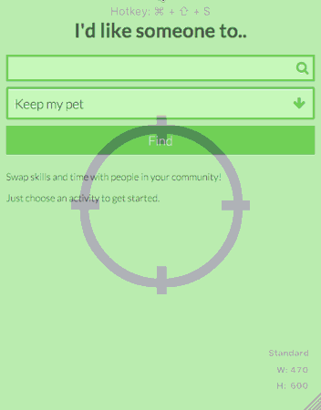

# Coding and app-making for beginners 

## Day 6

1. [Code](#code) the `details` screen
* [Pitch](#pitch) your ideas and prototypes
* [Resources](#resources) to continue your app-making journey
* [Celebrate](#celebrations)! :cake:


# Code!

**GOAL** To code the `details` screen, where users can view more info about a person (or destination, tool etc.) and then *contact* the person or *go back* to the `main` screen.



1. [Fork this pen](http://codepen.io/baddeo/full/JYpgwL)!
* Take a look at the **HTML** and notice the new structure:
	```html
	<div id="page_slider">
  		<div id="page1">
  			... all your current HTML here
  		</div>
  		<div id="page2">
  			...
  		</div>
	</div> 
	```
	
	`#page1` is the initial screen users will interact with
	
	`#page2` is where you are going to display details about a person / mentor / tool etc.
	
	`#page_slider` **wraps** `#page1` and `#page2`
* The *sliding* effect is a **CSS** trick:

	```css
	#page_slider {
  		width: 200%;
  		transition: margin-left .2s ease-out;
	}
	
	#page_slider.details_view {
  		margin-left: -100%;
	}
	```
	
	`#page_slider` (aka the *wrapper*) is set to be `200%` wide, so that it can accommodate 2 "pages". 
	
	When we want to display the details page `#page2`, we can use **JavaScript** to add the class `details_view`, which sets the `margin-left` to -100%, effectively sliding the wrapper half-way to the left.
* Add new data to the **spreadsheet** (aka the *database*) so that each row has a `picture` URL, and some `description`.

	For example:
	
	* `name` > `Yuki`
	* `image` > `http://cdn.themill.com/media/00000010245.jpg`
	* `description` > `Expert baker and food writer` 
* In **JS**, there are some functions you will need to hack:
	
	In `function getPeopleList`:
		
	Find the line where the `person` object is filled with data from the spreadsheet 
	```js
	person.name = row.gsx$name.$t
	// add the line below to add the image data to the person
	person.image = row.gsx$image.$t
	// and do the same for the description
	```
* In **JS**, `function displayList`:
		
	Find and **delete** the lines where `li` is created and appended to `listContainer` 
	```js
	var li = '<li>' + person.name + '</li>'
    listContainer.append(li)
    ```
	
	Add the lines below
	```js
	var listItem = $(getListItem(person))

     // when someone clicks on the list item..
     // execute the function onListItemClick
     // and "bind" it to the current person
     // otherwise it would display the wrong person's data
     listItem.on('click', onListItemClick.bind(this, person))

     // append = add at the end..
     listContainer.append(listItem)
    ``` 
* In **JS**, *copy-paste* the following functions from our pen into your pen, at the bottom of the JS panel
       
	* `function getListItem`
	* `function onListItemClick`
	* `function getDetails`
	* `function displayDetails`
* In **JS**, *copy-paste* the code below at the bottom of the JS panel
	
	```js
	$('#back').on('click', function()
	{
	   $('#page_slider').removeClass('details_view') 
	})
	```
	

# Pitch!

Pitch your idea and show your prototype!

You can use Google Slides, or [slides.com](http://slides.com), to put together a quick presentation.

### Presentation tips

#### **FACT** 

Generally, people remember **2-3 ideas** from a talk. Which ones you want them to remember? 

#### **PLANNING** 

Don't try to explain everything. Pick out 2-3 **key ideas** and explain them in the simplest way you can. 

#### **INTRO** 

Explain the *background* of your talk and give a quick *summary* of what you're going to talk about. People will pay more attention if they have a sense of what's coming next.

#### **SLIDES** are not a necessity. 

Ask yourself: is a slideshow the most effective way to communicate this? **How else** could I get this point across?
	
For instance, asking your audience a few *open* questions, getting them to play a game, break them out into small groups to discuss a scenario..

#### **SLIDES AGAIN**	 

If you *must* use slides, then:
	
* One **point** per slide.
	
* Don't cram long texts in your slides. Keep them down to a few *keywords* and one image or two..

#### **DELIVERY** 

Don't read out slides. 

It's distracting both for you and for your audience.

#### **TOP TIP** 

Use **examples** and **stories** from your experience. They will make your points more **relatable**: more interesting to listen to and easier to learn.

### Your turn

* Mention *market* and *business opportunities*  
* Mention *competitors*
* Talk about *customer research* (remember [interviews](../03/README.md#who-are-your-users)?)
* Tell us the **story** of your user


# Resources

* [Codecademy](https://www.codecademy.com/)
	
	> Free online courses to learn just about any coding language you like!

* [Dash](https://dash.generalassemb.ly/)

	> Free online courses to get you going in HTML, CSS and a little JavaScript
	
* [CSS-Tricks](https://css-tricks.com/)

	> Fantastic resource for CSS, invaluable for beginners and experienced front-end designers alike!
	
* [Smashing Magazine](http://www.smashingmagazine.com/)

	> Online magazine focused on coding and web development, covering techniques, coding languages, mobile, design, graphics and WordPress
	
* [Creative Bloq](http://www.creativebloq.com/)
	
	> Online magazine providing inspiration for graphic design, web design, 3D art and more

* [Niice](https://niice.co/)

	> A design search engine, drawing results from [Behance](https://www.behance.net/), [Dribble](https://dribbble.com/) and [Designspiration](http://designspiration.net/). Great if you're in need of some design inspiration!
	
* [Panda App](https://usepanda.com/app/#/)

	> Another great source of inspiration pulling results from various sources like [DesigneNnews](https://www.designernews.co/), [Dribble](https://dribbble.com/), [Behance](https://www.behance.net/) and [SiteInspire](http://www.siteinspire.com/)

* [GoodUI](http://goodui.org/)

	> Extensive list of good design patterns for user interfaces
	
* [UserOnboard](https://www.useronboard.com/)

	> Teardowns of major apps - a great reference for designing your interfaces
	
* [CodeWars](http://www.codewars.com/about)

	> Complete challenges in Javascript and improve your ranking! A fun resource for learning new tricks and comparing the many different ways to complete a task
	
* [HackDesign](https://hackdesign.org/lessons)

	> Learn how to design digital products, with lessons spanning from typography to UX (user experience).
	
* [Noun Project](https://thenounproject.com)

	> Huge database of beautiful icons to use in your app
	
* [Colour Contrast check](http://snook.ca/technical/colour_contrast/colour.html#fg=33FF33,bg=333333)

	> Tool to check the readability of your colours, ensuring they're easy on the eyes
	
* [Abobe Color CC](https://color.adobe.com/create/color-wheel/)

	> Great tool to design your colour palettes
	
* [JS for cats](http://jsforcats.com/)

	> Introduction to JavaScript..."So easy your human companion could do it too!" :scream_cat:
	
* [Random User Generator](https://randomuser.me/)

	> Random users for you to populate your app prototypes
	
* [Pttrns](http://pttrns.com/)

	> See how other mobile designers solve UX problems for things like calculators, calendars, search and more
	
* [WTF Mobile Web](http://wtfmobileweb.com/)

	> What not to do!
	

# 15 things you've achieved in 24 hours!


1. Unpacked the **design process**: iterative, collaborative

2. Discussed examples of **good design patterns** applicaple to user interfaces within apps and many other digital content

3. Analysed the **mechanics** of a Web application, breaking down its behaviour into *data*, *functions* and *logic*.

4. Applied this knowledge to your own ideas, learning how to **develop and structure your designs** 

5. Identified your **user**

6. Identified a **problem** for your user

7. Researched **existing products** to better inform your ideas

8. Produced initial **wireframes** by sketching

9. Produced more in depth, detailed wireframes using **digital mock-up tools**

10. Familiarised yourself with and understood the role of the **three key technologies** of the web:
	- Learned the basics of **HTML** and created your first interactive page
	- Learned the basics of **CSS** and styled your first page
	- Survived an introduction to **Javascript and JQuery!**, experiencing the core components of Javascript and understanding *most* of it!

11. Linked **spreadsheet data** to your code to produce the beginnings of a usable prototype

12. Familiarised yourselves with **APIs**, understanding their role in app design and function

13. **Presented your ideas** to the team and integrated their constructive feedback into your work

14. Assessed other team members ideas and **provided constructive feedback**
	- Able to analyse ideas and identify gaps in the user experience

15. Overseen the whole process of app prototyping whilst creating **proof-of-concept prototypes** for Web applications


**...Job well done!**


# Let's celebrate!

And remember...

1. Googling problems is not *cheating*
	
	> Google is your friend
2. Copy-pasting code is not *cheating*

	> Good coders type, great coders copy-paste
4. Iterate and collaborate
   
   > Try again (and again) until it works and ask for feedback
5. **It's OK**. You're not going to break anything


# Keep moving forward in your learning journey!


We need your **feedback**, it will hugely help us improve this course!

### [tinyurl.com/o8qknkg](http://tinyurl.com/o8qknkg)


### License

[](http://creativecommons.org/licenses/by-nc-sa/4.0)

This work is licensed under a [Creative Commons Attribution-NonCommercial-ShareAlike 4.0 International License ](http://creativecommons.org/licenses/by-nc-sa/4.0)
